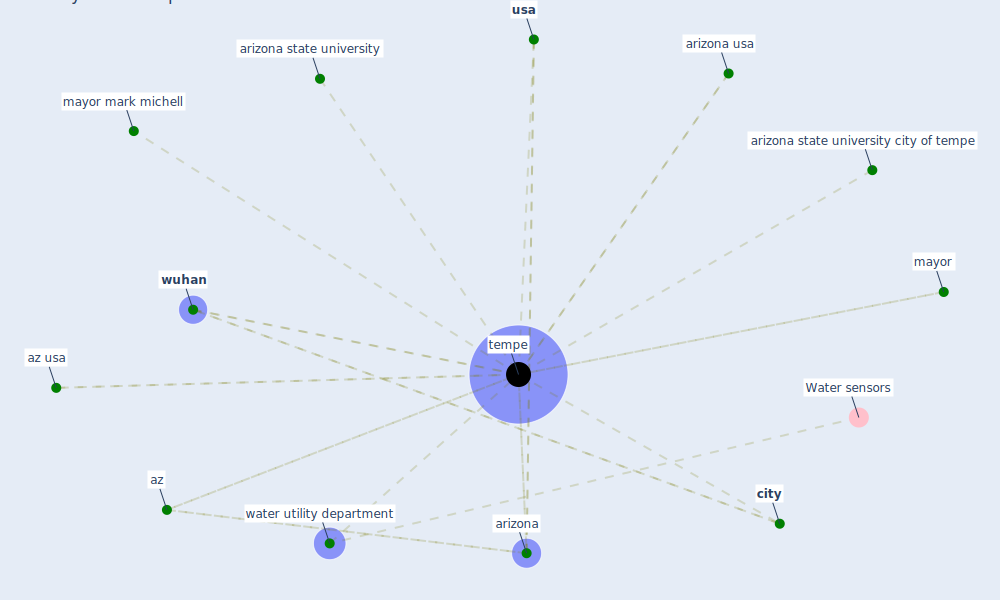

# Keyword: tempe

## Keywords

 * arizona, arizona state university, arizona state university city of tempe, arizona usa, az, az usa, [city](keyword_city), mayor, mayor mark michell, [tempe](keyword_tempe), [usa](keyword_usa), water utility department, [wuhan](keyword_wuhan)

## Mapping

## Neighbours

### Closest articles

* Computational analysis of SARS-CoV-2/COVID-19 surveillance by wastewater-based epidemiology locally and globally: Feasibility, economy, opportunities and challenges - [LINK](article_hart_computational_2020)
* An environmental and health perspective for COVID-19 outbreak: Meteorology and air quality influence, sewage epidemiology indicator, hospitals disinfection, drug therapies and recommendations - [LINK](article_barcelo_environmental_2020)
* Wastewater surveillance for population-wide Covid-19: The present and future - [LINK](article_daughton_wastewater_2020)

### Closest BPs

