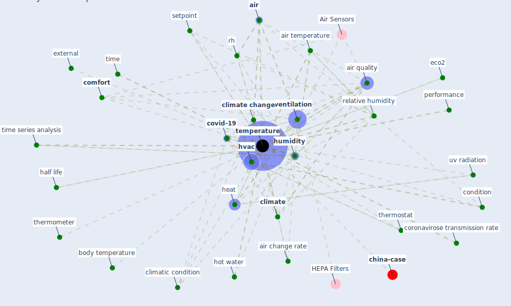

# Keyword: temperature

* [building-design](cluster_3)

* [iaq-system](cluster_5)

## Keywords

 * 30 c, 4 c, absolute humidity, ai algorithm, [air](keyword_air), [air change rate](keyword_air_change_rate), [air pollution](keyword_air_pollution), air quality, air temperature, ambient, ambient temperature, average deviation, body temperature, [climate](keyword_climate), [climate change](keyword_climate_change), climate level, climatic condition, cold, comfort, condition, coronavirose transmission rate, cov19, [covid-19](keyword_covid-19), eco2, ecological, elevation, external, efficiency, [green building](keyword_green_building), half life, heat, heat generation, heat index, heat wave, heating setpoint, high temperature, hot water, hotwater, hu midity, humid, humidification, [humidity](keyword_humidity), [hvac](keyword_hvac), in sewer, indoor air temperature, indoor temperature, indoorenv, [influenza](keyword_influenza), infrare, infrared thermometer, influence, influenza virus transmission, mean humidity, measurement, mercury thermometer, meteorological, minimum, minimum temperature, [monitor](keyword_monitor), office, pasteurization, performance, persistence, population density, [pressure](keyword_pressure), production of heat, proportional, rainfall, relative b humidity, relative humidity, relativehumidity, residence time, [rh](keyword_rh), room air temperature, [sensor](keyword_sensor), set point, setpoint, spread of the virus, t hreshold7, temperament, [temperature](keyword_temperature), temperature and humidity setpoint, temperature and humidity setpoint 1, temperature regulation, thermography, thermometer, [thermostat](keyword_thermostat), [time](keyword_time), time series analysis, [transmission](keyword_transmission), uv radiation, vector capacity, [ventilation](keyword_ventilation), [virus](keyword_virus), warm climate, [wastewater](keyword_wastewater), water vapor, weather, weather factor, wind

## Mapping

## Neighbours

### Closest articles

* Effects of temperature and humidity on the spread of COVID-19: A systematic review - [LINK](article_mecenas_effects_2020)
* Mechanistic insights into the effect of humidity on airborne influenza virus survival, transmission and incidence - [LINK](article_marr_mechanistic_2019)
* A critical review of heating, ventilation, and air conditioning (HVAC) systems within the context of a global SARS-CoV-2 epidemic - [LINK](article_elsaid_critical_2021)
* Review and comparison of HVAC operation guidelines in different countries during the COVID-19 pandemic - [LINK](article_guo_review_2021)
* Scalable IoT Architecture for Monitoring IEQ Conditions in Public and Private Buildings - [LINK](article_calvo_scalable_2022)
* Assessment method for new sustainability indicators providing pandemic resilience for residential buildings - [LINK](article_tokazhanov_assessment_2021)
* Climate and the spread of COVID-19 - [LINK](article_chen_climate_2021)
* Health, Wellbeing \& Productivity in Offices - [LINK](article_world_green_building_council_health_2014)
* Assessment of Building Automation and Control Systems in Danish Healthcare Facilities in the COVID-19 Era - [LINK](article_pedersen_assessment_2022)
* ASHRAE Position Document on Infectious Aerosols - [LINK](article_ashrae_ashrae_2022)

### Closest BPs

