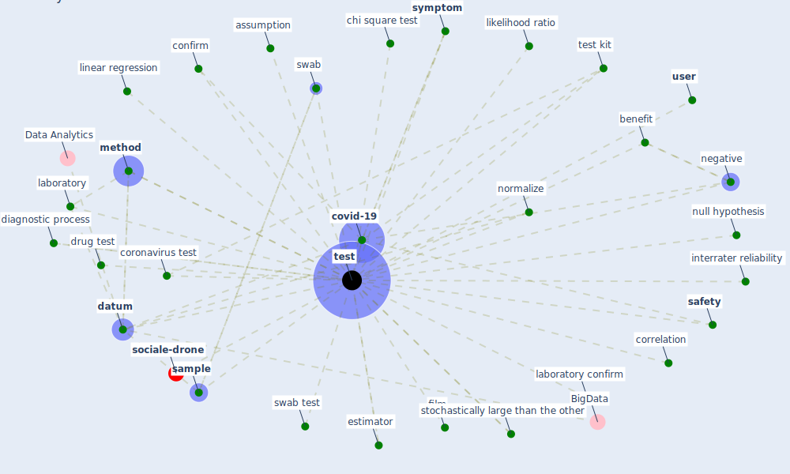

# Keyword: test

* [sociale-drone](cluster_6)

## Keywords

 * 90253 v chamola, Cluster_6, anamnesis, aneed test, anova test, antigen, [application](keyword_application), assessment, assumption, asymptomatic, be test, benefit, beta test, body temperature, [case](keyword_case), chi square test, coefficient variation, col united lection, confirm, confirm case, confound, [coronavirus](keyword_coronavirus), coronavirus test, coronavirus testing, correlation, [covid-19](keyword_covid-19), [datum](keyword_datum), [dbaf](keyword_dbaf), diagnose, [diagnosis](keyword_diagnosis), diagnostic, diagnostic process, diagnostic test, [drug](keyword_drug), drug test, estimator, examine, follow procedure, incubate, interrater reliability, laboratory, laboratory confirm, likelihood ratio, linear regression, mann whitney test, [method](keyword_method), nasopharyngeal, negative, normalize, null hypothesis, parameter range, psychometric test, [random](keyword_random), react to it, reverse transcription polymerase chain reaction, risk test, [safety](keyword_safety), [sample](keyword_sample), sar cov 2 rna, [school](keyword_school), scientific manner, self isolate, self isolation, sequence, serologic, serologic test, significance threshold, [simulation](keyword_simulation), [simulation model](keyword_simulation_model), speciman, standardization test, statistically significant, stochastically, stochastically large than the other, swab, swab test, [symptom](keyword_symptom), [test](keyword_test), test kit, test negative, test set up, tested, testing, testing method, testprecise, tests, throat swab, [trace](keyword_trace), trace measure, train, [training](keyword_training), unique code, unit root test, urine, urine sample, [user](keyword_user), [vaccine](keyword_vaccine), validation, [virus](keyword_virus), [film](keyword_film)

## Mapping

## Neighbours

### Closest articles

* Supporting Technologies for COVID-19 Prevention: Systemized Review - [LINK](article_zhao_supporting_2022)
* A Comprehensive Review of the COVID-19 Pandemic and the Role of IoT, Drones, AI, Blockchain, and 5G in Managing its Impact - [LINK](article_chamola_comprehensive_2020)
* Overcoming the Impact of COVID-19 Using Integrated Project Delivery Model - [LINK](article_g_overcoming_2020)
* Scalable IoT Architecture for Monitoring IEQ Conditions in Public and Private Buildings - [LINK](article_calvo_scalable_2022)
* Future perspectives of wastewater-based epidemiology: Monitoring infectious disease spread and resistance to the community level - [LINK](article_sims_future_2020)
* Coronavirus disease 2019: The harms of exaggerated information and non‐evidence‐based measures - [LINK](article_ioannidis_coronavirus_2020)
* A Surface Coating that Rapidly Inactivates SARS-CoV-2 - [LINK](article_behzadinasab_surface_2020)
* Wastewater surveillance for population-wide Covid-19: The present and future - [LINK](article_daughton_wastewater_2020)
* Association between indoor-outdoor green features and psychological health during the COVID-19 lockdown in Italy: A cross-sectional nationwide study - [LINK](article_spano_association_2021)
* Risk Diagnosis and Mitigation System of COVID-19 Using Expert System and Web Scraping - [LINK](article_mufid_risk_2020)

### Closest BPs

