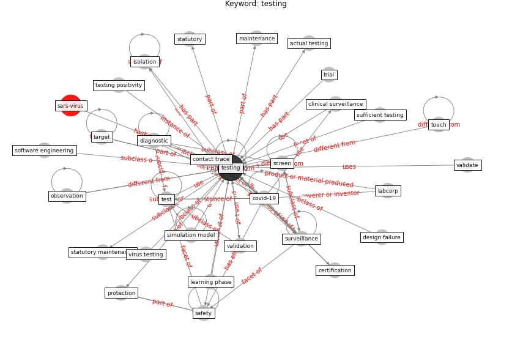

# Keyword: testing

* [sars-virus](cluster_Cluster_12)

## Keywords

 * Cluster_12, actual testing, american society of testing and material, antibodie test, [application](keyword_application), bio molecular diagnostic, browse, browse through, certification, cleanability, clinical diagnostic, clinical diagnostic testing, clinical surveillance, clinical testing, co location, contact trace, contaminant, continuously, [coronavirus](keyword_coronavirus), covid 19 testing, [covid-19](keyword_covid-19), criterion for testing, [datum](keyword_datum), design failure, diagnosis, diagnostic, diagnostic testing, difference between country and immigrant, evaluate, genome sequencing, [healthcare](keyword_healthcare), incubation period, [isolation](keyword_isolation), labcorp, laboratory, learning phase, maintenance, material and method, method, [mobility](keyword_mobility), national testing system, [negative](keyword_negative), notify, observation, pleasure, positive, protection, prototype, reteste, [safety](keyword_safety), sample collection, screen, self swab, sensitivity analysis, serological, [simulation model](keyword_simulation_model), software engineering, speed, statutory, statutory maintenance, stool, sufficient testing, [surveillance](keyword_surveillance), swab, target, test, test coverage, test regime, [testing](keyword_testing), testing intensity, testing kit, testing positivity, testing regime vary considerably nationally, testing system, threshold, throat swab, touch, trace, trial, validate, validation, virus testing, [wastewater](keyword_wastewater), water quality management, workflow

## Concepts

 

## Neighbours

### Closest articles

* Wastewater surveillance for population-wide Covid-19: The present and future - [LINK](article_daughton_wastewater_2020)
* Applications of ultraviolet germicidal irradiation disinfection in health care facilities: Effective adjunct, but not stand-alone technology - [LINK](article_memarzadeh_applications_2010)
* Risk Diagnosis and Mitigation System of COVID-19 Using Expert System and Web Scraping - [LINK](article_mufid_risk_2020)
* Supporting Technologies for COVID-19 Prevention: Systemized Review - [LINK](article_zhao_supporting_2022)
* The impact of COVID-19 and strategies for mitigation and suppression in low- and middle-income countries - [LINK](article_walker_impact_2020)
* How COVID-19 Could Accelerate the Adoption of New Retail Technologies and Enhance the (E-)Servicescape - [LINK](article_willems_how_2021)
* A Comprehensive Review of the COVID-19 Pandemic and the Role of IoT, Drones, AI, Blockchain, and 5G in Managing its Impact - [LINK](article_chamola_comprehensive_2020)
* Climate and the spread of COVID-19 - [LINK](article_chen_climate_2021)
* Digital Twin of COVID-19 Mass Vaccination Centers - [LINK](article_pilati_digital_2021)

### Closest BPs

