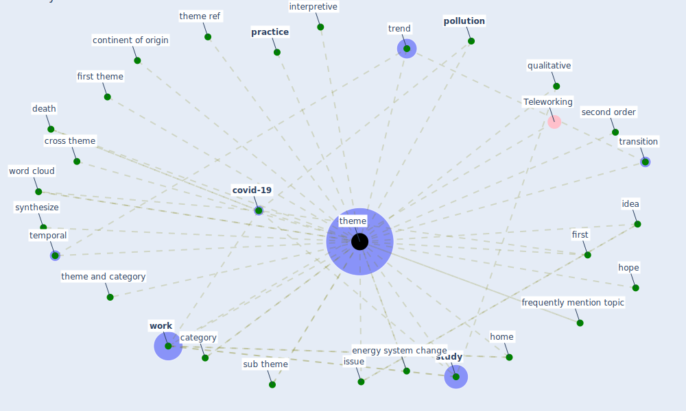

# Keyword: theme

## Keywords

 * [build environment](keyword_build_environment), category, continent of origin, [covid-19](keyword_covid-19), cross theme, death, energy system change, frequently mention topic, [home](keyword_home), hope, idea, interpretive, interpretive method, issue, paper cross theme, [pollution](keyword_pollution), [practice](keyword_practice), [qualitative](keyword_qualitative), second order, second order theme, [study](keyword_study), sub theme, subcategorie, synthesize, system preparedness, temporal, [theme](keyword_theme), theme and category, theme ref, themes, transition, trend, word cloud, [work](keyword_work), first, first theme

## Mapping

## Neighbours

### Closest articles

* How loneliness is talked about in social media during COVID-19 pandemic: Text mining of 4,492 Twitter feeds - [LINK](article_koh_how_2022)
* The Impact of Pandemic Crisis on the Survival of Construction Industry: A Case of COVID-19 - [LINK](article_gamil_impact_2020)
* Mechanisms for addressing the impact of COVID-19 on infrastructure projects - [LINK](article_king_mechanisms_2021)
* The COVID-19 pandemic: Impacts on cities and major lessons for urban planning, design, and management - [LINK](article_sharifi_covid-19_2020)
* Respiratory pandemics, urban planning and design: A multidisciplinary rapid review of the literature - [LINK](article_harris_respiratory_2022)
* Startups in times of crisis – A rapid response to the COVID-19 pandemic - [LINK](article_kuckertz_startups_2020)
* Contributions of Smart City Solutions and Technologies to Resilience against the COVID-19 Pandemic: A Literature Review - [LINK](article_sharifi_contributions_2021)
* A study on office workplace modification during the COVID-19 pandemic in The Netherlands - [LINK](article_hou_study_2021)
* Exploring the Potential of Artificial Intelligence and Machine Learning to Combat COVID-19 and Existing Opportunities for LMIC: A Scoping Review - [LINK](article_naseem_exploring_2020)
* Covid-19 and the politics of sustainable energy transitions - [LINK](article_kuzemko_covid-19_2020)

### Closest BPs

