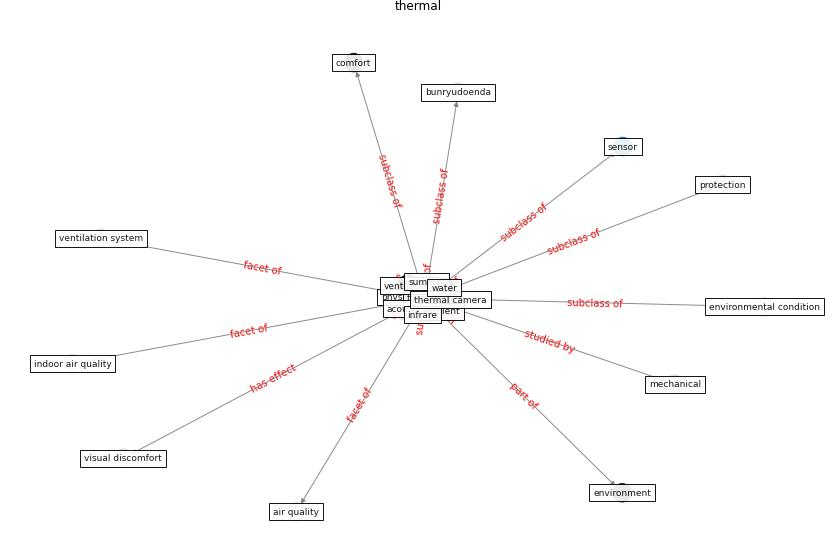

# Keyword: __thermal__
## Clusters

* Cluster 5: [ieq-sensor](cluster_5)

## Concepts

 

## Articles
* Occupant health in buildings: Impact of the COVID-19
pandemic on the opinions of building professionals and
implications on research ([awada_occupant_2022](article_awada_occupant_2022))
* Design and Implementation of Entry-level COVID-19
Digital Signage Player supporting Fever
Detection, Face Mask Wearing Detection and
KI-pass QR Code Checking ([huy-tran_design_2022](article_huy-tran_design_2022))
* Review and comparison of HVAC operation guidelines in
different countries during the COVID-19 pandemic ([guo_review_2021](article_guo_review_2021))
* Ten questions concerning occupant health in buildings
during normal operations and extreme events including the
COVID-19 pandemic ([awada_ten_2021](article_awada_ten_2021))
* lam_smart_2021 ([lam_smart_2021](article_lam_smart_2021))
* ashrae_ashrae_2022 ([ashrae_ashrae_2022](article_ashrae_ashrae_2022))
* An Intelligent IEQ Monitoring and Feedback
System: Development and Applications ([geng_intelligent_2021](article_geng_intelligent_2021))
* Occupants’ behavior and activity patterns influencing
the energy consumption in the Kuwaiti residences ([al-mumin_occupants_2003](article_al-mumin_occupants_2003))
* Assessment of Building Automation and Control
Systems in Danish Healthcare Facilities in the
COVID-19 Era ([pedersen_assessment_2022](article_pedersen_assessment_2022))
* The effect of occupant distribution on energy consumption
and COVID-19 infection in buildings: A case study of
university building ([mokhtari_effect_2021](article_mokhtari_effect_2021))
