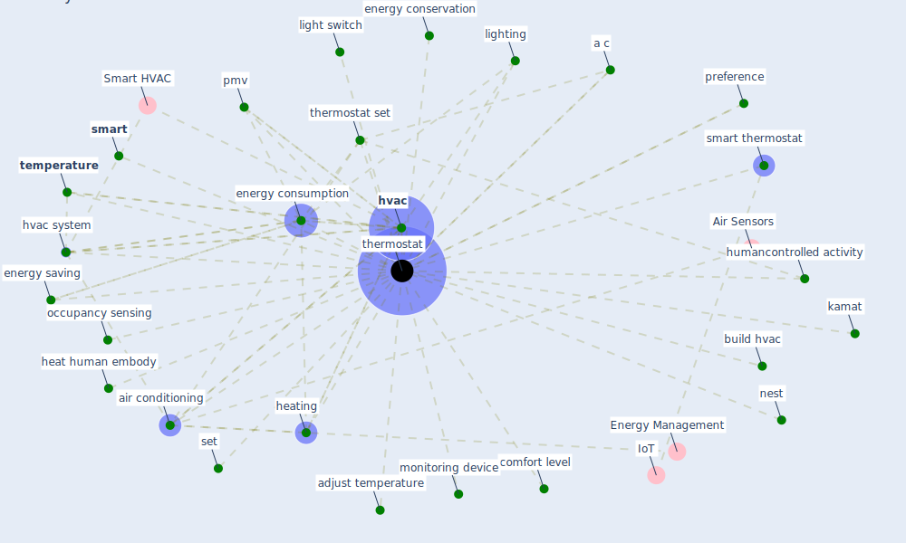

# Keyword: thermostat

## Keywords

 * [a c](keyword_a_c), adjust temperature, [air conditioning](keyword_air_conditioning), build hvac, comfort level, energy conservation, [energy consumption](keyword_energy_consumption), energy saving, heat human embody, heating, humancontrolled activity, [hvac](keyword_hvac), [hvac system](keyword_hvac_system), kamat, light switch, lighting, monitoring device, nest, occupancy sensing, pmv, preference, set, [smart](keyword_smart), smart thermostat, [temperature](keyword_temperature), [thermostat](keyword_thermostat), thermostat set, thermostats

## Mapping

## Neighbours

### Closest articles

* Occupants’ behavior and activity patterns influencing the energy consumption in the Kuwaiti residences - [LINK](article_al-mumin_occupants_2003)
* Impact of COVID-19 on IoT Adoption in Healthcare, Smart Homes, Smart Buildings, Smart Cities, Transportation and Industrial IoT - [LINK](article_umair_impact_2021)
* Prophylactic Architecture: Formulating the Concept of Pandemic-Resilient Homes - [LINK](article_elrayies_prophylactic_2022)
* The effect of occupant distribution on energy consumption and COVID-19 infection in buildings: A case study of university building - [LINK](article_mokhtari_effect_2021)
* Ten questions concerning occupant health in buildings during normal operations and extreme events including the COVID-19 pandemic - [LINK](article_awada_ten_2021)
* An Intelligent IEQ Monitoring and Feedback System: Development and Applications - [LINK](article_geng_intelligent_2021)
* A review of facilities management interventions to mitigate respiratory infections in existing buildings - [LINK](article_zhang_review_2022)
* 2019 Novel Coronavirus (COVID-19) Pandemic: Built Environment Considerations To Reduce Transmission - [LINK](article_dietz_2019_2020)

### Closest BPs

