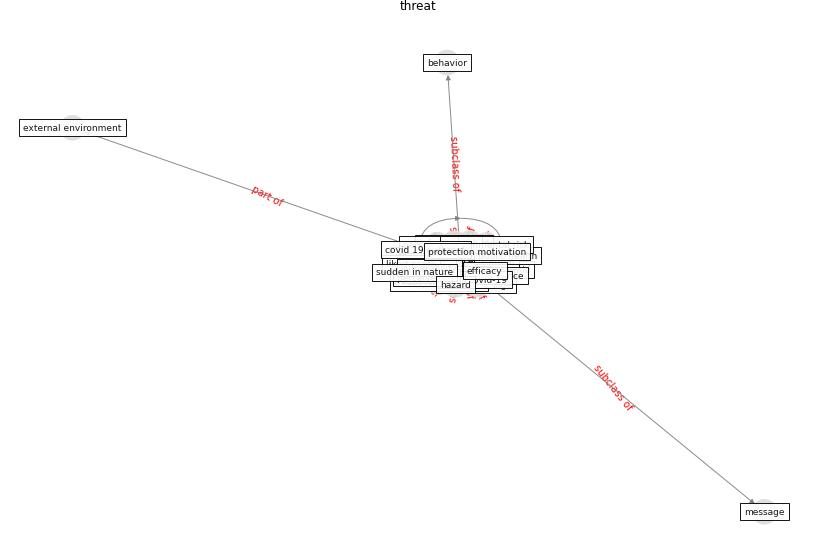

# Keyword: __threat__
## Clusters

* Cluster 12: [climate-change](cluster_12)

## Concepts

 

## Top 10 articles for __threat__
* The Intelligent Lockdown: Compliance with COVID-19
Mitigation Measures in the Netherlands ([kuiper_intelligent_2020](article_kuiper_intelligent_2020))
* How COVID-19 Could Accelerate the Adoption of
New Retail Technologies and Enhance the
(E-)Servicescape ([willems_how_2021](article_willems_how_2021))
* ogunnusi_covid-19_2020 ([ogunnusi_covid-19_2020](article_ogunnusi_covid-19_2020))
* oecd_covid-19_2021 ([oecd_covid-19_2021](article_oecd_covid-19_2021))
* Startups in times of crisis – A rapid response to the
COVID-19 pandemic ([kuckertz_startups_2020](article_kuckertz_startups_2020))
* Exploring the Non-Medical impacts of Covid-19 using
Natural Language Processing ([agade_exploring_2020](article_agade_exploring_2020))
* who_strengthening_2017 ([who_strengthening_2017](article_who_strengthening_2017))
* Compliance with COVID-19 Mitigation Measures in the
United States ([van_rooij_compliance_2020](article_van_rooij_compliance_2020))
* nassereddine_propositions_2021 ([nassereddine_propositions_2021](article_nassereddine_propositions_2021))
* yan_10_2020 ([yan_10_2020](article_yan_10_2020))
