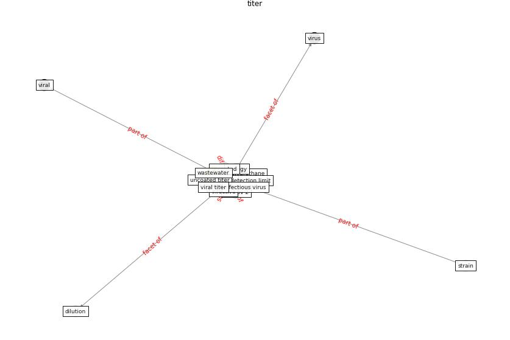

# Keyword: __titer__

## Concepts

 

## Top articles for __titer__
* A Surface Coating that Rapidly Inactivates
SARS-CoV-2 ([behzadinasab_surface_2020](article_behzadinasab_surface_2020))
* Aerosol and Surface Stability of SARS-CoV-2 as
Compared with SARS-CoV-1 ([van_doremalen_aerosol_2020](article_van_doremalen_aerosol_2020))
* SARS-CoV-2 Titers in Wastewater Are Higher
than Expected from Clinically Confirmed Cases ([wu_sars-cov-2_2020](article_wu_sars-cov-2_2020))
