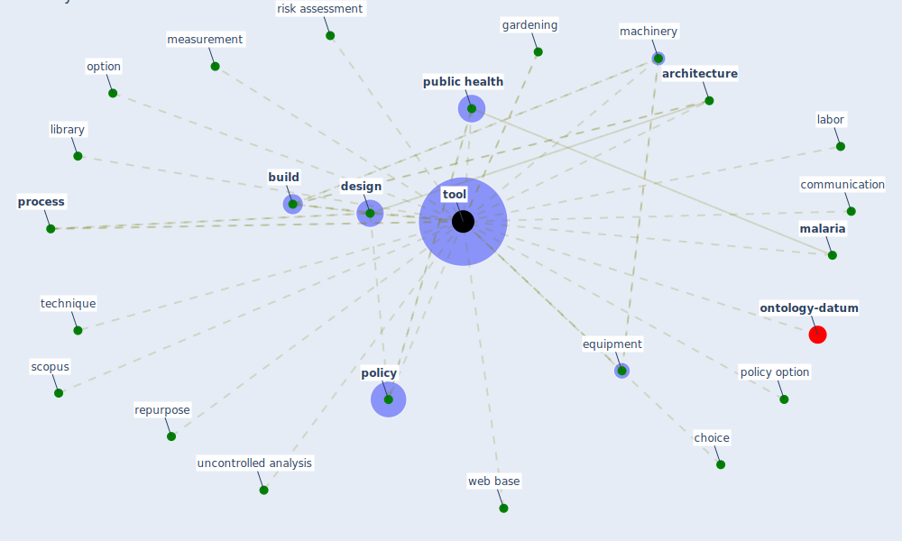

# Keyword: tool

* [ontology-datum](cluster_12)

## Keywords

 * Cluster_12, [architecture](keyword_architecture), [build](keyword_build), choice, communication, [design](keyword_design), equipment, [gardening](keyword_gardening), labor, library, machinery, [malaria](keyword_malaria), measurement, option, [policy](keyword_policy), policy option, [process](keyword_process), [public health](keyword_public_health), repurpose, risk assessment, scopus, technique, [tool](keyword_tool), tools, uncontrolled analysis, web base

## Mapping

## Neighbours

### Closest articles

* Guidelines for Responding to COVID-19 Pandemic: Best Practices, Impacts, and Future Research Directions - [LINK](article_assaad_guidelines_2021)
* An Overview of Biomedical Ontologies for Pandemics and Infectious Diseases Representation - [LINK](article_bayoudhi_overview_2021)
* How COVID-19 Could Accelerate the Adoption of New Retail Technologies and Enhance the (E-)Servicescape - [LINK](article_willems_how_2021)
* Assessment of Building Automation and Control Systems in Danish Healthcare Facilities in the COVID-19 Era - [LINK](article_pedersen_assessment_2022)
* Overcoming the Impact of COVID-19 Using Integrated Project Delivery Model - [LINK](article_g_overcoming_2020)
* COVID-19: Risk assessment and mitigation measures in healthcare and non-healthcare workplaces - [LINK](article_fawzy_covid-19_2021)
* The role of green roofs in post COVID-19 confinement: An analysis of willingness to pay - [LINK](article_manso_role_2021)
* World Bank Development Report - [LINK](article_world_bank_world_2022)
* Navigating Climate Change: Rethinking the Role of Buildings - [LINK](article_cole_navigating_2020)
* Home garden use during COVID-19: Associations with physical and mental wellbeing in older adults - [LINK](article_corley_home_2021)

### Closest BPs

