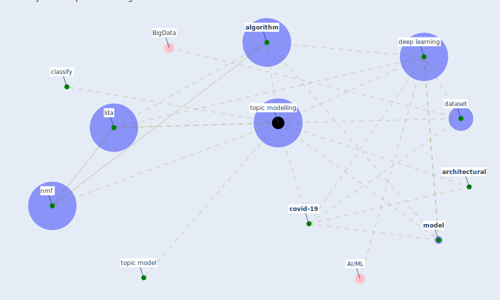

# Keyword: topic modelling

## Keywords

 * [algorithm](keyword_algorithm), [architectural](keyword_architectural), classify, [covid-19](keyword_covid-19), [dataset](keyword_dataset), [deep learning](keyword_deep_learning), [lda](keyword_lda), [model](keyword_model), nmf, topic model, [topic modelling](keyword_topic_modelling)

## Mapping

## Neighbours

### Closest articles

* Exploring the Non-Medical impacts of Covid-19 using Natural Language Processing - [LINK](article_agade_exploring_2020)

### Closest BPs

