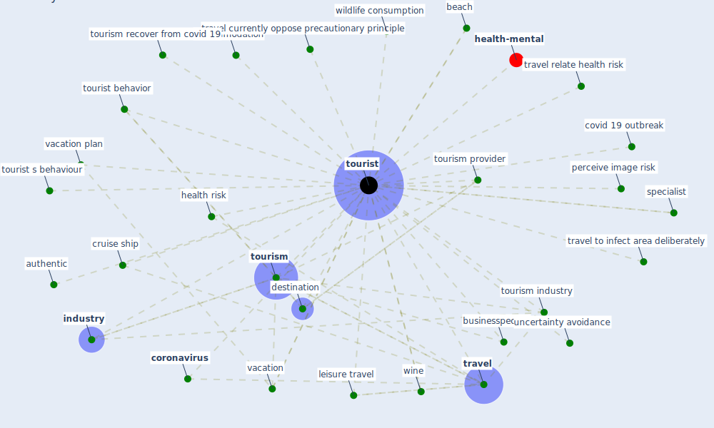

# Keyword: tourist

* [health-mental](cluster_10)

## Keywords

 * Cluster_10, accommodation, authentic, back packer, backpacker, beach, behaviour, businesspeople, [consumer](keyword_consumer), [coronavirus](keyword_coronavirus), covid 19 outbreak, cruise ship, destination, ex backpacker, food tourism, health risk, [image](keyword_image), [industry](keyword_industry), leisure travel, minimize their travel time, oxford learner s dictionary, perceive image risk, recreation, [risk perception](keyword_risk_perception), specialist, the covid 19 outbreak, [tour](keyword_tour), [tourism](keyword_tourism), tourism demand, tourism industry, tourism provider, tourism recover from covid 19, [tourist](keyword_tourist), tourist behavior, tourist s behaviour, tourists, [travel](keyword_travel), travel currently oppose precautionary principle, travel relate health risk, travel to infect area deliberately, uncertainty avoidance, vacation, vacation plan, wildlife consumption, wine

## Mapping

## Neighbours

### Closest articles

* Seeing the invisible hand: Underlying effects of COVID-19 on tourists’ behavioral patterns - [LINK](article_li_seeing_2020)
* Should I Stay or Should I Go? Tourists’ COVID-19 Risk Perception and Vacation Behavior Shift - [LINK](article_bratic_should_2021)
* Indirect effects of COVID-19 on the environment - [LINK](article_zambrano-monserrate_indirect_2020)
* The socio-economic determinants of COVID-19: A spatial analysis of German county level data - [LINK](article_ehlert_socio-economic_2021)
* The Role of Architecture and Urbanism in Preventing Pandemics - [LINK](article_kumar_role_2021)
* How COVID-19 Could Accelerate the Adoption of New Retail Technologies and Enhance the (E-)Servicescape - [LINK](article_willems_how_2021)
* The impact of the COVID-19 pandemic on the importance of urban green spaces to the public - [LINK](article_noszczyk_impact_2022)

### Closest BPs

