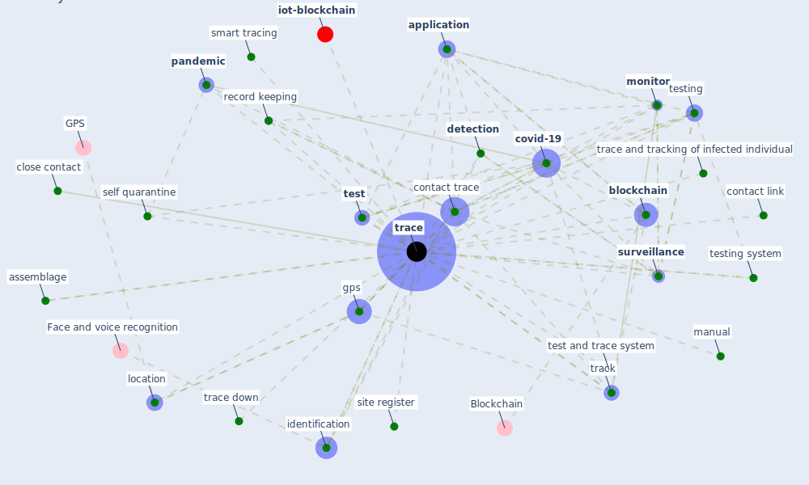

# Keyword: trace

* [iot-blockchain](cluster_7)

## Keywords

 * Cluster_7, [application](keyword_application), assemblage, asset, [blockchain](keyword_blockchain), close contact, contact link, contact trace, [covid-19](keyword_covid-19), [detection](keyword_detection), [gps](keyword_gps), identification, location, manual, [monitor](keyword_monitor), [pandemic](keyword_pandemic), record keeping, self quarantine, site register, smart tracing, [surveillance](keyword_surveillance), [test](keyword_test), test and trace system, testing, testing system, [trace](keyword_trace), trace and tracking of infected individual, trace down, traces, tracing, track, underlie asset

## Mapping

## Neighbours

### Closest articles

* Mobile Technology Solution for COVID-19: Surveillance and Prevention - [LINK](article_raza_mobile_2021)
* Contributions of Smart City Solutions and Technologies to Resilience against the COVID-19 Pandemic: A Literature Review - [LINK](article_sharifi_contributions_2021)
* Impact of COVID-19 on IoT Adoption in Healthcare, Smart Homes, Smart Buildings, Smart Cities, Transportation and Industrial IoT - [LINK](article_umair_impact_2021)
* The role of 5G for digital healthcare against COVID-19 pandemic: Opportunities and challenges - [LINK](article_siriwardhana_role_2021)
* A Comprehensive Review of the COVID-19 Pandemic and the Role of IoT, Drones, AI, Blockchain, and 5G in Managing its Impact - [LINK](article_chamola_comprehensive_2020)
* Analysis of COVID-19 Concerns Raised by the Construction Workforce and Development of Mitigation Practices - [LINK](article_bou_hatoum_analysis_2021)
* Strategies to Mitigate COVID-19 Pandemic Impacts on Health and Safety of Workers in Construction Projects - [LINK](article_kaushal_strategies_2021)
* The three modes of existence of the pandemic smart city - [LINK](article_soderstrom_three_2021)
* COVID-19 Prevention and Control Measures in Workplace Settings: A Rapid Review and Meta-Analysis - [LINK](article_ingram_covid-19_2021)
* World Bank Development Report - [LINK](article_world_bank_world_2022)

### Closest BPs

