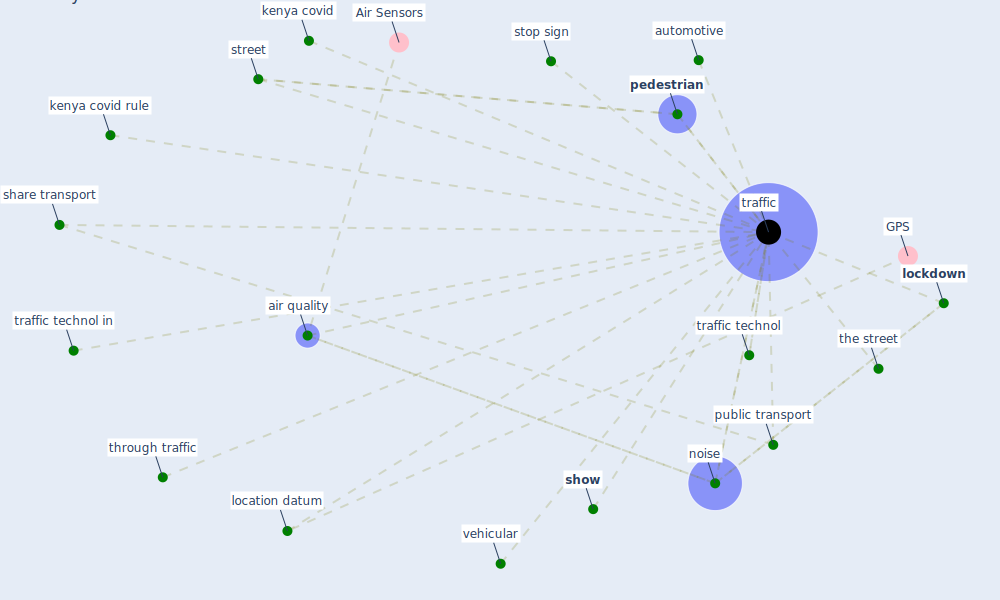

# Keyword: traffic

## Keywords

 * air quality, automotive, kenya covid, kenya covid rule, location datum, [lockdown](keyword_lockdown), [noise](keyword_noise), [pedestrian](keyword_pedestrian), [public transport](keyword_public_transport), share transport, [show](keyword_show), stop sign, street, the street, through traffic, [traffic](keyword_traffic), traffic technol, traffic technol in, trafficking, vehicular

## Mapping

## Neighbours

### Closest articles

* Smart cities and a data-driven response to COVID-19 - [LINK](article_james_smart_2020)
* Urban planning after COVID-19 - [LINK](article_rtpi_urban_2021)
* The City Under COVID‐19: Podcasting As Digital Methodology - [LINK](article_rogers_city_2020)
* Pandemic Analytics: How Countries are Leveraging Big Data Analytics and Artificial Intelligence to Fight COVID-19? - [LINK](article_mehta_pandemic_2021)
* Impact of COVID-19 on IoT Adoption in Healthcare, Smart Homes, Smart Buildings, Smart Cities, Transportation and Industrial IoT - [LINK](article_umair_impact_2021)
* Future (post-COVID) digital, smart and sustainable cities in the wake of 6G: Digital twins, immersive realities and new urban economies - [LINK](article_allam_future_2021)
* Housing Experience in Gated Communities in the Time of Pandemics: Lessons Learned from COVID-19 - [LINK](article_asfour_housing_2022)
* 2020 Data Protection Report - [LINK](article_council_of_europe_2020_2020)
* The Role of Architecture and Urbanism in Preventing Pandemics - [LINK](article_kumar_role_2021)
* Retail Signage During the COVID-19 Pandemic - [LINK](article_mcneish_retail_2020)

### Closest BPs

