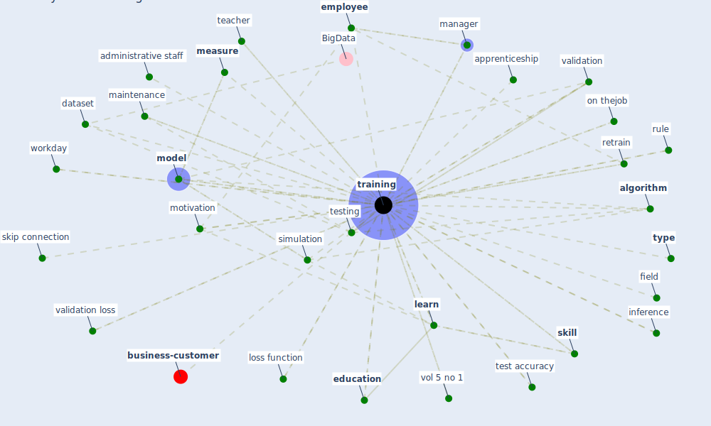

# Keyword: training

* [business-customer](cluster_11)

## Keywords

 * Cluster_11, administrative staff, [algorithm](keyword_algorithm), apprenticeship, communication, [corporate](keyword_corporate), corporate training, corporate training program, [dataset](keyword_dataset), [detection](keyword_detection), detection speed, development, distance learning, [education](keyword_education), education level, empathy training for leader, [employee](keyword_employee), employee training, [employment](keyword_employment), forhandle, [healthcare](keyword_healthcare), human detection, human resource, inference, [information](keyword_information), internship, [learn](keyword_learn), length, lifelong learning, loss function, maintenance, [manager](keyword_manager), manager training, [measure](keyword_measure), meeting, military, [model](keyword_model), motivation, on thejob, online course, overfitte, qualification, [resilience](keyword_resilience), retrain, rule, sensibilization, [simulation](keyword_simulation), [skill](keyword_skill), skip connection, some element, [study](keyword_study), systematic, systematic training, teacher, [test](keyword_test), test accuracy, testing, testing set, theory, trainer, [training](keyword_training), trainings, [type](keyword_type), up and reskille, validation, validation loss, video training, vol 5 no 1, workday, [workplace](keyword_workplace), workplace rule, field

## Mapping

## Neighbours

### Closest articles

* How COVID-19 Could Accelerate the Adoption of New Retail Technologies and Enhance the (E-)Servicescape - [LINK](article_willems_how_2021)
* An Automated System to Limit COVID-19 Using Facial Mask Detection in Smart City Network - [LINK](article_rahman_automated_2020)
* Sustainable work throughout the life course: National policies and strategies, Publications Office of the European Union - [LINK](article_eurofund_sustainable_2016)
* Case Study on Finnish TVETA Resilient Model of Training During COVID-19 - [LINK](article_unesco_case_2021)
* Management of the COVID-19 pandemic: challenges, practices, and organizational support - [LINK](article_hossny_management_2022)
* DeepSOCIAL: Social Distancing Monitoring and Infection Risk Assessment in COVID-19 Pandemic - [LINK](article_rezaei_deepsocial_2020)
* What has been the impact of the COVID-19 pandemic on immigrants? An update on recent evidence - [LINK](article_oecd_what_2022)
* Towards the sustainable development of smart cities through mass video surveillance: A response to the COVID-19 pandemic - [LINK](article_shorfuzzaman_towards_2021)
* Significant applications of virtual reality for COVID-19 pandemic - [LINK](article_singh_significant_2020)
* Assessment of COVID-19 precautionary measures in sports facilities: A case study on a health club in Saudi Arabia - [LINK](article_ibrahim_assessment_2022)

### Closest BPs

