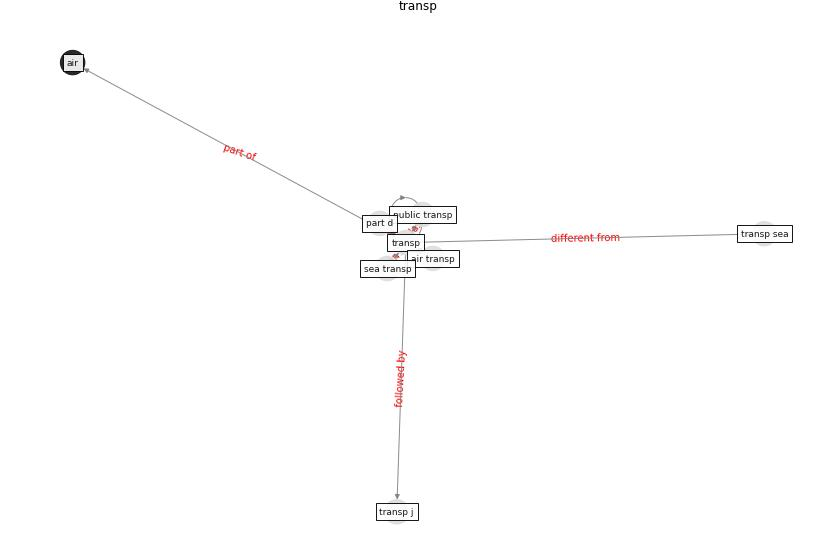

# Keyword: __transp__

## Concepts

 

## Top articles for __transp__
* Responsible Transport: A post-COVID agenda for
transport policy and practice ([budd_responsible_2020](article_budd_responsible_2020))
* Mobility Behaviour in View of the Impact of the
COVID-19 Pandemic—Public Transport Users in
Gdansk Case Study ([przybylowski_mobility_2021](article_przybylowski_mobility_2021))
* The COVID-19 pandemic: Impacts on cities and major
lessons for urban planning, design, and management ([sharifi_covid-19_2020](article_sharifi_covid-19_2020))
