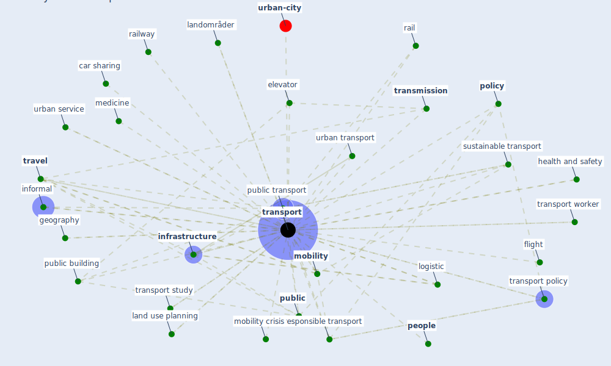

# Keyword: transport

* [urban-city](cluster_6)

## Keywords

 * Cluster_6, active transport, [air](keyword_air), airflow, [airport](keyword_airport), [arbejdspladsen](keyword_arbejdspladsen), [big datum](keyword_big_datum), bil, [build](keyword_build), car, car sharing, [china](keyword_china), [city](keyword_city), commute, commuter, confine building, connectivity, [coronavirus](keyword_coronavirus), covid agenda, [cycling](keyword_cycling), [datum](keyword_datum), [delivery](keyword_delivery), demand, demand for transport, elevator, exhaust, expert survey, fight corona, flight, fokusering, food, forstyrret, geography, green infrastructure, green transportation, [health](keyword_health), [health and safety](keyword_health_and_safety), [housing](keyword_housing), informal, [infrastructure](keyword_infrastructure), klimabelastne, land use planning, landområder, [logistic](keyword_logistic), long distance transport, material, mean of transport, medicine, [mobility](keyword_mobility), mobility crisis, mode of transport, noise complaint, operator, passenger transport, [pathogen](keyword_pathogen), [people](keyword_people), [policy](keyword_policy), policy sector, [public](keyword_public), public building, [public transport](keyword_public_transport), rail, railway, [responsible transport](keyword_responsible_transport), road transport, safe transport, samt mindst lige så meget transport, [sector](keyword_sector), semi formal, [service](keyword_service), share mode of transport, smart travel, størrelse, sustainable transport, [technology](keyword_technology), [transmission](keyword_transmission), [transport](keyword_transport), transport accessibility, transport debate, transport finding, transport infrastructure, [transport policy](keyword_transport_policy), transport sector, transport study, transport worker, transportation, transportation mode, transportation research part d, transported, transporten, transporting, [travel](keyword_travel), travel pattern, ultra cold freezer, urban design, urban infrastructure, urban road, urban service, urban transport, [virus](keyword_virus)

## Mapping

## Neighbours

### Closest articles

* Urban planning after COVID-19 - [LINK](article_rtpi_urban_2021)
* Responsible Transport: A post-COVID agenda for transport policy and practice - [LINK](article_budd_responsible_2020)
* Mobility Behaviour in View of the Impact of the COVID-19 Pandemic—Public Transport Users in Gdansk Case Study - [LINK](article_przybylowski_mobility_2021)
* Refleksioner fra en pandemi - [LINK](article_realdania_refleksioner_2022)
* A critical analysis of the impacts of COVID-19 on the global economy and ecosystems and opportunities for circular economy strategies - [LINK](article_ibn-mohammed_critical_2021)
* Global value chains: Efficiency and risks in the context of COVID-19 - [LINK](article_oecd_global_2021)
* Impact of COVID-19 on IoT Adoption in Healthcare, Smart Homes, Smart Buildings, Smart Cities, Transportation and Industrial IoT - [LINK](article_umair_impact_2021)
* Association of built environment attributes with the spread of COVID-19 at its initial stage in China - [LINK](article_li_association_2021)
* RESIDENTIAL ARCHITECTURE IN A POST-PANDEMIC WORLD: IMPLICATIONS OF COVID-19 FOR NEW CONSTRUCTION AND FOR ADAPTING HERITAGE BUILDINGS - [LINK](article_spennemann_residential_2021)
* Respiratory pandemics, urban planning and design: A multidisciplinary rapid review of the literature - [LINK](article_harris_respiratory_2022)

### Closest BPs

