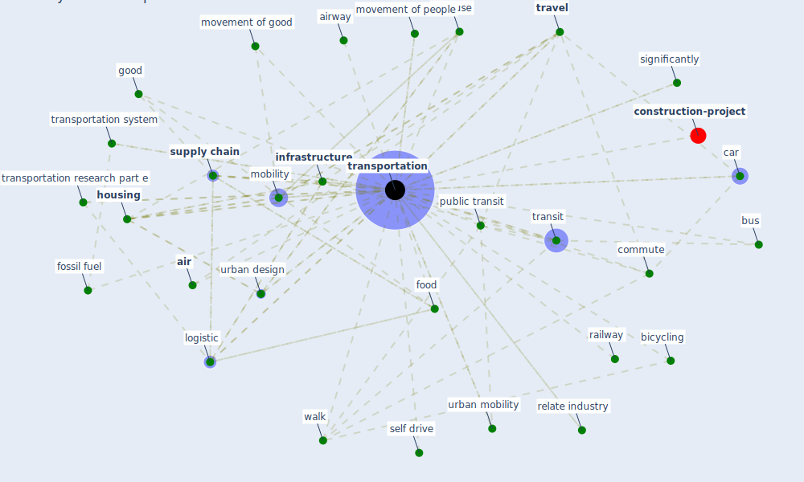

# Keyword: transportation

* [construction-project](cluster_8)

## Keywords

 * Cluster_8, accommodation, [air](keyword_air), airway, automobile, autonomous vehicle, aviation, bicycle transportation, bicycling, bike, bridge, [build](keyword_build), [bus](keyword_bus), car, car use, caxht8jd, [china](keyword_china), communication, commute, commute time, commuter, [construction](keyword_construction), construction inspection, [covid 19 crisis](keyword_covid_19_crisis), [covid-19](keyword_covid-19), development, distribution, [domain](keyword_domain), driver, [economic](keyword_economic), [energy](keyword_energy), energydemand, [environment](keyword_environment), [epidemiological](keyword_epidemiological), firebox, food, [fossil fuel](keyword_fossil_fuel), gas tax, good, green transportation, [health and safety](keyword_health_and_safety), [healthcare](keyword_healthcare), [housing](keyword_housing), [infrastructure](keyword_infrastructure), [iot](keyword_iot), land use, [logistic](keyword_logistic), maritime, [mobility](keyword_mobility), movement of good, movement of people, passenger, [people](keyword_people), private car, production, [public](keyword_public), public bus, [public health](keyword_public_health), public transit, [public transport](keyword_public_transport), public transportation, railway, relate industry, research part d, research part d transport and environment, research record, [resilience](keyword_resilience), responsible transport policy, ride sharing, roadway, [sector](keyword_sector), self drive, [shop](keyword_shop), significantly, smart logistic, smart transportation, smart transportation market, [space](keyword_space), [supply chain](keyword_supply_chain), [sustainable](keyword_sustainable), [system](keyword_system), telecommunication, [time](keyword_time), transit, transit agency, transit of supply, [transport](keyword_transport), [transportation](keyword_transportation), transportation and urban design, transportation infrastructure, transportation paradigm, transportation research part e, transportation support, transportation system, [travel](keyword_travel), [ug](keyword_ug), urban design, urban fabric, urban mobility, walk

## Mapping

## Neighbours

### Closest articles

* Impact of COVID-19 on IoT Adoption in Healthcare, Smart Homes, Smart Buildings, Smart Cities, Transportation and Industrial IoT - [LINK](article_umair_impact_2021)
* Impacts of COVID-19 on Health and Safety of Workforce in Construction Industry - [LINK](article_pamidimukkala_impacts_2021)
* The COVID-19 pandemic: Impacts on cities and major lessons for urban planning, design, and management - [LINK](article_sharifi_covid-19_2020)
* Mapping research in logistics and supply chain management during COVID-19 pandemic - [LINK](article_montoya-torres_mapping_2021)
* A critical analysis of the impacts of COVID-19 on the global economy and ecosystems and opportunities for circular economy strategies - [LINK](article_ibn-mohammed_critical_2021)
* The Role of Architecture and Urbanism in Preventing Pandemics - [LINK](article_kumar_role_2021)
* Strategies to Mitigate COVID-19 Pandemic Impacts on Health and Safety of Workers in Construction Projects - [LINK](article_kaushal_strategies_2021)
* Guidelines for Responding to COVID-19 Pandemic: Best Practices, Impacts, and Future Research Directions - [LINK](article_assaad_guidelines_2021)
* Urban design attributes and resilience: COVID-19 evidence from New York City - [LINK](article_yang_urban_2021)
* COVID-19 Pandemic: Rethinking Strategies for Resilient Urban Design, Perceptions, and Planning - [LINK](article_afrin_covid-19_2021)

### Closest BPs

