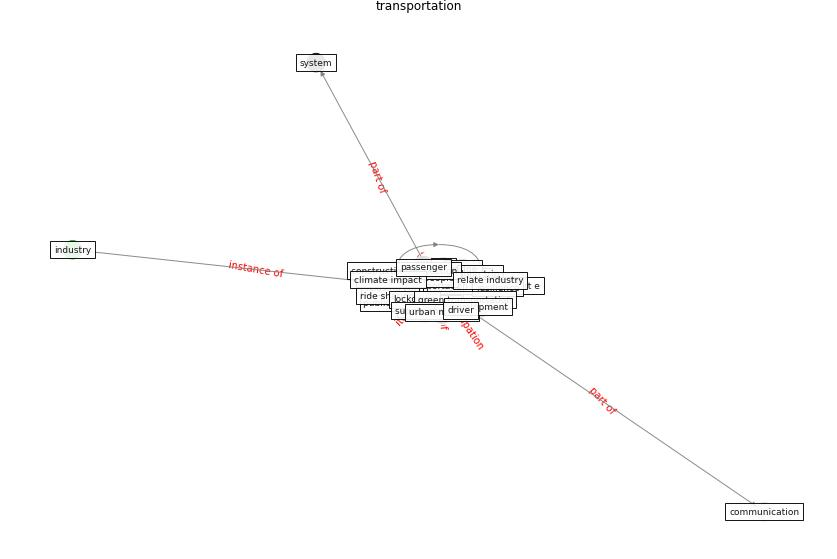

# Keyword: __transportation__
## Clusters

* Cluster 3: [construction-project](cluster_3.md)

## Concepts

 

## Articles
* Impacts of COVID-19 on Health and Safety of
Workforce in Construction Industry ([pamidimukkala_impacts_2021](article_pamidimukkala_impacts_2021.md))
* realdania_refleksioner_2022_EN-1750 ([realdania_refleksioner_2022_EN-1750](article_realdania_refleksioner_2022_EN-1750.md))
* afrin_covid-19_2021 ([afrin_covid-19_2021](article_afrin_covid-19_2021.md))
* The COVID-19 pandemic: Impacts on cities and major
lessons for urban planning, design, and management ([sharifi_covid-19_2020](article_sharifi_covid-19_2020.md))
* The COVID-19 pandemic: Impacts on cities and major
lessons for urban planning, design, and management ([sharifi_covid-19_2020](article_sharifi_covid-19_2020.md))
* Mapping research in logistics and supply chain management
during COVID-19 pandemic ([montoya-torres_mapping_2021](article_montoya-torres_mapping_2021.md))
* Perception of COVID-19 impacts on the construction
industry over time ([rokooei_perception_2022](article_rokooei_perception_2022.md))
* oecd_covid-19_2021-250 ([oecd_covid-19_2021-250](article_oecd_covid-19_2021-250.md))
* Revisiting the built environment: 10 potential development
changes and paradigm shifts due to COVID-19 ([cheshmehzangi_revisiting_2021](article_cheshmehzangi_revisiting_2021.md))
* The Impact of Pandemic Crisis on the Survival of
Construction Industry: A Case of COVID-19 ([gamil_impact_2020](article_gamil_impact_2020.md))
