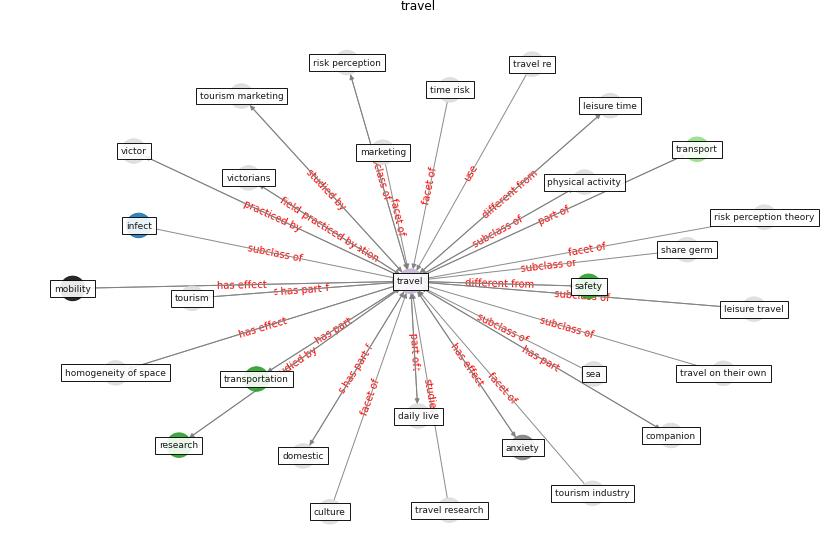

# Keyword: travel

* [memish-saudi](cluster_Cluster_8)

## Keywords

 * Cluster_8, active transportation, activity, activity mobility behavior, adventure, adventure narration, [air](keyword_air), airline, [anxiety](keyword_anxiety), anxiety about miss a flight, aviation, backpacker, business traveller, canoe race, car, commute, companion, [company](keyword_company), [coronavirus](keyword_coronavirus), covid 19 coronavirus pandemic, cruise ship, cruise tourism, cultural, culture, daily live, [disease](keyword_disease), disease outbreak, [domestic](keyword_domestic), elastic supplement, [energy](keyword_energy), entertainment, germ, [globalisation](keyword_globalisation), guardian, health risk, high risk city, homogeneity of space, hospitality, international, leisure travel, [marketing](keyword_marketing), med j, [mobility](keyword_mobility), nomad lodge, non essential travel, physical activity, plane, private car, public form of transport, public transit, [public transport](keyword_public_transport), [research](keyword_research), [restriction](keyword_restriction), [risk](keyword_risk), [risk perception](keyword_risk_perception), risk perception theory, [safety](keyword_safety), school education, sea, service acquisition, share germ, share mode of transport, small unit, [social distancing](keyword_social_distancing), social life, spatial, spread of disease, stop at home, [study](keyword_study), sustainable and healthy transportation, [symptom](keyword_symptom), time distance, time risk, [tour](keyword_tour), [tourism](keyword_tourism), tourism industry, tourism management, tourism marketing, tourist, trade, train, [transmission](keyword_transmission), [transport](keyword_transport), transport mode, transportation, transportation infrastructure, [travel](keyword_travel), travel anxiety, travel behavior, travel notice, travel on their own, travel re, travel research, travel statistic, travel style, traveling, travelling, urban infrastructure, victor, victorians

## Concepts

 

## Neighbours

### Closest articles

* Seeing the invisible hand: Underlying effects of COVID-19 on tourists’ behavioral patterns - [LINK](article_li_seeing_2020)
* Should I Stay or Should I Go? Tourists’ COVID-19 Risk Perception and Vacation Behavior Shift - [LINK](article_bratic_should_2021)
* How COVID-19 Could Accelerate the Adoption of New Retail Technologies and Enhance the (E-)Servicescape - [LINK](article_willems_how_2021)
* Urban planning after COVID-19 - [LINK](article_rtpi_urban_2021)
* The socio-economic implications of the coronavirus pandemic (COVID-19): A review - [LINK](article_nicola_socio-economic_2020)
* The Socio-Spatial Determinants of COVID-19 Diffusion: The Impact of Globalisation, Settlement Characteristics and Population - [LINK](article_sigler_socio-spatial_2020)
* Coronavirus questions that will not go away: interrogating urban and socio-spatial implications of COVID-19 measures - [LINK](article_salama_coronavirus_2020)
* Mobility Behaviour in View of the Impact of the COVID-19 Pandemic—Public Transport Users in Gdansk Case Study - [LINK](article_przybylowski_mobility_2021)
* Urban Community Sustainable Development Patterns under the Influence of COVID-19: A Case Study Based on the Non-Contact Interaction Perspective of Hangzhou City - [LINK](article_wang_urban_2021)
* The COVID-19 pandemic: Impacts on cities and major lessons for urban planning, design, and management - [LINK](article_sharifi_covid-19_2020)

### Closest BPs

