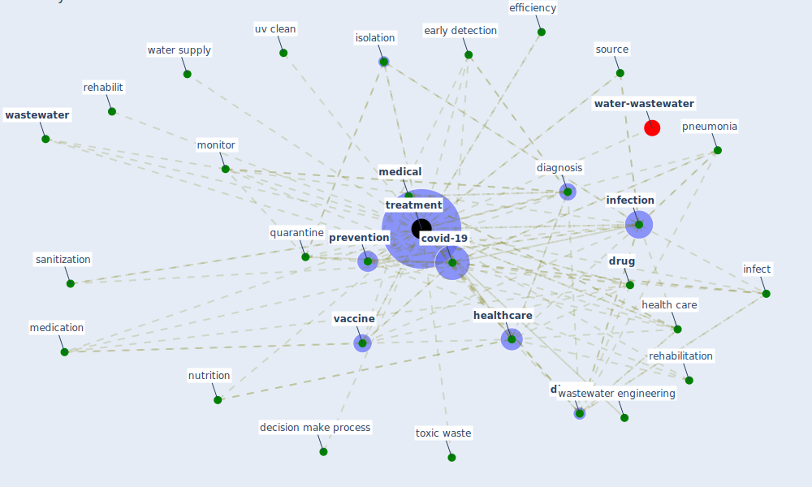

# Keyword: treatment

* [water-wastewater](cluster_7)

## Keywords

 * Cluster_7, antiretroviral, care, cost, covid 19 disease, [covid-19](keyword_covid-19), curative, curative research, decision make process, diagnosis, [disease](keyword_disease), [disinfection](keyword_disinfection), [drug](keyword_drug), early detection, effectiveness, efficiency, exercise, fatality rate, [health care](keyword_health_care), health care authority, [healthcare](keyword_healthcare), healthcare facility, [hospital](keyword_hospital), infect, [infection](keyword_infection), isolation, laser, line of treatment, long treatment, [management](keyword_management), [medical](keyword_medical), medication, [monitor](keyword_monitor), nutrition, patient care, [plant](keyword_plant), pneumonia, [prevention](keyword_prevention), prevention and control, preventive vaccine, [psychological](keyword_psychological), quarantine, recovery rate, regulate storage tank, rehabilit, rehabilitation, [research](keyword_research), sanitization, source, [surgery](keyword_surgery), symptomatic, [telemedicine](keyword_telemedicine), tertiary operation, toxic waste, [treatment](keyword_treatment), treatment course, treatment plant, treatment protocol, treatments, uv clean, [vaccine](keyword_vaccine), [wastewater](keyword_wastewater), wastewater collection and treatment, wastewater engineering, wastewater management, wastewater treatment, water supply

## Mapping

## Neighbours

### Closest articles

* A Comprehensive Review of the COVID-19 Pandemic and the Role of IoT, Drones, AI, Blockchain, and 5G in Managing its Impact - [LINK](article_chamola_comprehensive_2020)
* Design COVID-19 Ontology: A Healthcare and Safety Perspective - [LINK](article_aloulou_design_2022)
* How the 5G Enabled the COVID-19 Pandemic Prevention and Control: Materiality, Affordance, and (De-)Spatialization - [LINK](article_li_how_2022)
* Leveraging Digital Transformation Technologies to Tackle COVID-19: Proposing a Privacy-First Holistic Framework - [LINK](article_arpaci_leveraging_2021)
* Supporting Technologies for COVID-19 Prevention: Systemized Review - [LINK](article_zhao_supporting_2022)
* Significant applications of virtual reality for COVID-19 pandemic - [LINK](article_singh_significant_2020)
* A critical review of heating, ventilation, and air conditioning (HVAC) systems within the context of a global SARS-CoV-2 epidemic - [LINK](article_elsaid_critical_2021)
* The COVID-19 pandemic: Impacts on cities and major lessons for urban planning, design, and management - [LINK](article_sharifi_covid-19_2020)
* When the fourth water and digital revolution encountered COVID-19 - [LINK](article_poch_when_2020)
* Understanding the role of urban design in disease spreading - [LINK](article_brizuela_understanding_2019)

### Closest BPs

