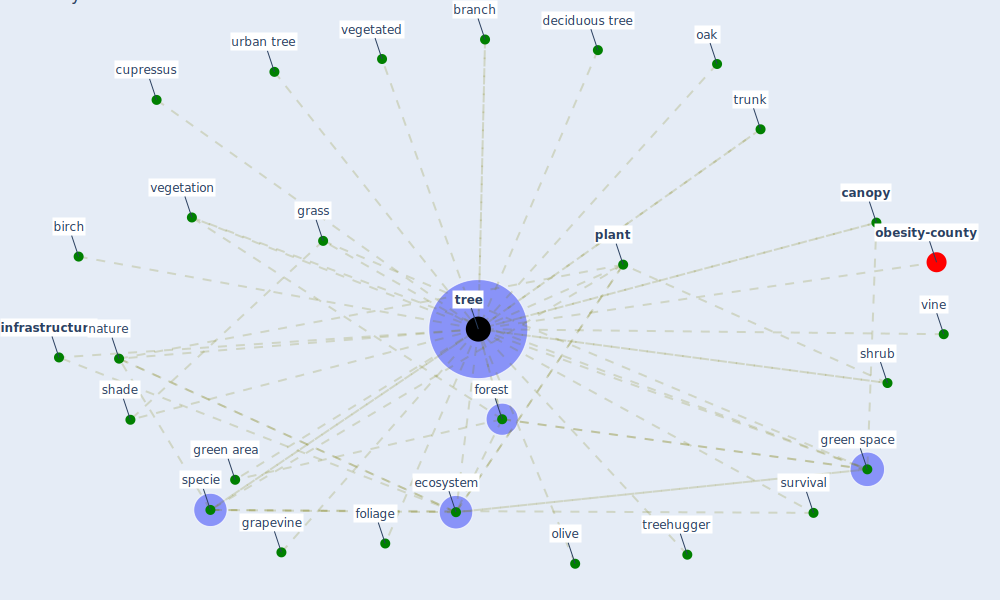

# Keyword: tree

* [obesity-county](cluster_9)

## Keywords

 * Cluster_9, birch, branch, [canopy](keyword_canopy), cupressus, deciduous tree, [ecosystem](keyword_ecosystem), foliage, [forest](keyword_forest), grapevine, grass, green area, [green space](keyword_green_space), [infrastructure](keyword_infrastructure), [nature](keyword_nature), oak, olive, [plant](keyword_plant), shade, shrub, specie, survival, [tree](keyword_tree), treehugger, trees, trunk, urban tree, vegetated, vegetation, vine

## Mapping

## Neighbours

### Closest articles

* Green spaces, especially forest, linked to lower SARS-CoV-2 infection rates: A one-year nationwide study - [LINK](article_jiang_green_2021)
* Making green infrastructure healthier infrastructure - [LINK](article_lohmus_making_2015)
* Effects of the COVID-19 pandemic on the use and perceptions of urban green space: An international exploratory study - [LINK](article_ugolini_effects_2020)
* Treating two pandemics for the price of one: Chronic and infectious disease impacts of the built and natural environment - [LINK](article_frank_treating_2021)
* Biophilic design in architecture and its contributions to health, well-being, and sustainability: A critical review - [LINK](article_zhong_biophilic_2022)
* Green infrastructure through the lens of “One Health”: A systematic review and integrative framework uncovering synergies and trade-offs between mental health and wildlife support in cities - [LINK](article_felappi_green_2020)
* Occupants’ behavior and activity patterns influencing the energy consumption in the Kuwaiti residences - [LINK](article_al-mumin_occupants_2003)
* Association between indoor-outdoor green features and psychological health during the COVID-19 lockdown in Italy: A cross-sectional nationwide study - [LINK](article_spano_association_2021)
* Integrating rapid risk mapping and mobile phone call record data for strategic malaria elimination planning - [LINK](article_tatem_integrating_2014)
* Health, Wellbeing \& Productivity in Offices - [LINK](article_world_green_building_council_health_2014)

### Closest BPs

