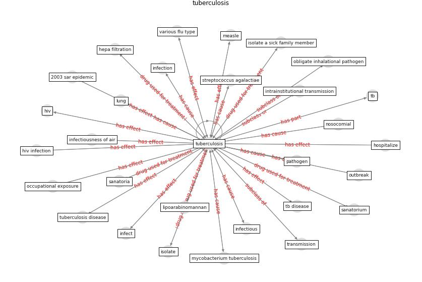

# Keyword: tuberculosis

* [uv-air](cluster_Cluster_4)

## Keywords

 * 2003 sar epidemic, acute, aerial dissemination, ai model, air sample, airborne disease, [airborne infection](keyword_airborne_infection), airborne transmission, anthrax, [antibiotic](keyword_antibiotic), [architecture](keyword_architecture), affect, affect the lung, bacilli, [bacteria](keyword_bacteria), [cdc](keyword_cdc), [cholera](keyword_cholera), cholera pandemic, [covid-19](keyword_covid-19), [disease](keyword_disease), disease transmission, drug resistant tuberculosis, environmental control, environmental factor, [epidemic](keyword_epidemic), evan, extend cluster, extensively drug resistant, extensively drugresistant strain, guinea pig, hepa filtration, [hiv](keyword_hiv), hiv infection, hospitalize, infect, [infection](keyword_infection), infectious, infectious agent, [infectious disease](keyword_infectious_disease), infectiousness of air, intrainstitutional transmission, isolate, isolate a sick family member, koch s bacillus, lipoarabinomannan, long term illness, lung, measle, [mortality](keyword_mortality), multidrugresistance tuberculosis, mycobacterium, mycobacterium tuberculosis, nardell, nardell 2015, negative air ionization, nosocomial, obligate inhalational pathogen, occupational exposure, [outbreak](keyword_outbreak), [pandemic](keyword_pandemic), [pathogen](keyword_pathogen), powerful antibiotic, respiratory, respiratory disease, respiratory infectious disease, resurgence, resurgence of tuberculosis, rhinovirus, rise of disease, samuel bernheim, san francisco, san francisco s homeless adult, sanatoria, sanatorium, [sar cov 1](keyword_sar_cov_1), sar cov 1 outbreak, second line antibiotic, sickness of overcrowded city, sputum culture, streptococcus agalactiae, streptomycin, streptomycin antibiotic, [tb](keyword_tb), tb disease, the white plague, [transmission](keyword_transmission), tuberculin skin test, [tuberculosis](keyword_tuberculosis), tuberculosis disease, ultraviolet germicidal irradiation, ultraviolet shelter study, undiagnosed, urine, [uv light](keyword_uv_light), [uvgi](keyword_uvgi), vaccination, vaccination rate, various flu type, white plague, world health organisation

## Concepts

 

## Neighbours

### Closest articles

* Upper-Room Ultraviolet Light and Negative Air Ionization to Prevent Tuberculosis Transmission - [LINK](article_escombe_upper-room_2009)
* COVID-19 Could Leverage a Sustainable Built Environment - [LINK](article_pinheiro_covid-19_2020)
* The Role of Architecture and Urbanism in Preventing Pandemics - [LINK](article_kumar_role_2021)
* Applications of ultraviolet germicidal irradiation disinfection in health care facilities: Effective adjunct, but not stand-alone technology - [LINK](article_memarzadeh_applications_2010)
* Air Disinfection for Airborne Infection Control with a Focus on COVID‐19: Why Germicidal UV is Essential             † - [LINK](article_nardell_air_2021)
* Environmental factors involved in SARS-CoV-2 transmission: effect and role of indoor environmental quality in the strategy for COVID-19 infection control - [LINK](article_azuma_environmental_2020)
* How can airborne transmission of COVID-19 indoors be minimised? - [LINK](article_morawska_how_2020)
* ASHRAE Position Document on Infectious Aerosols - [LINK](article_ashrae_ashrae_2022)
* Epidemics, Planning and the City: A Special Issue of Planning Perspectives - [LINK](article_davis_epidemics_2022)
* A Review on Building Design as a Biomedical System for Preventing COVID-19 Pandemic - [LINK](article_amran_review_2022)

### Closest BPs

