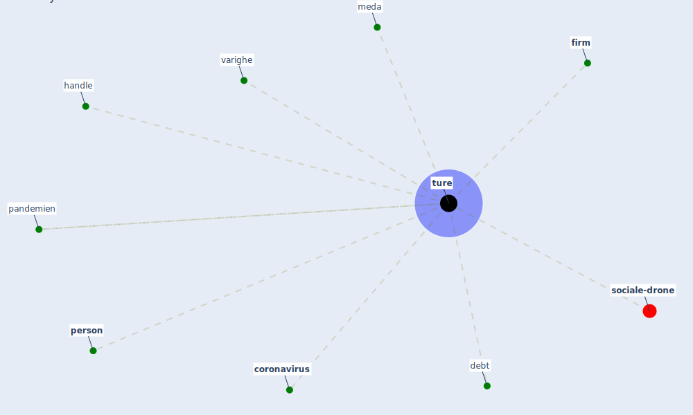

# Keyword: ture

* [sociale-drone](cluster_6)

## Keywords

 * Cluster_6, [coronavirus](keyword_coronavirus), debt, [firm](keyword_firm), handle, meda, [pandemien](keyword_pandemien), [person](keyword_person), [ture](keyword_ture), turing, varighe

## Mapping

## Neighbours

### Closest articles

* Refleksioner fra en pandemi - [LINK](article_realdania_refleksioner_2022)
* World Bank Development Report - [LINK](article_world_bank_world_2022)
* COVID-19 Experience Transforming the Protective Environment of Office Buildings and Spaces - [LINK](article_phapant_covid-19_2021)

### Closest BPs

