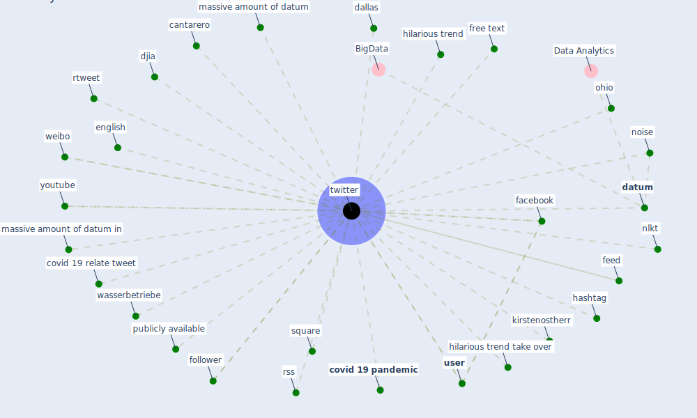

# Keyword: twitter

## Keywords

 * cantarero, [covid 19 pandemic](keyword_covid_19_pandemic), covid 19 relate tweet, dallas, [datum](keyword_datum), djia, english, [facebook](keyword_facebook), feed, follower, free text, hashtag, hilarious trend, hilarious trend take over, kirstenostherr, massive amount of datum, massive amount of datum in, nlkt, [noise](keyword_noise), ohio, publicly available, rss, rtweet, square, [twitter](keyword_twitter), [user](keyword_user), wasserbetriebe, weibo, youtube

## Mapping

## Neighbours

### Closest articles

* How loneliness is talked about in social media during COVID-19 pandemic: Text mining of 4,492 Twitter feeds - [LINK](article_koh_how_2022)
* Infodemic and the spread of fake news in the COVID-19-era - [LINK](article_orso_infodemic_2020)
* The changes in the effects of social media use of Cypriots due to COVID-19 pandemic - [LINK](article_kaya_changes_2020)
* COVID19-Routes: A Safe Pedestrian Navigation Service - [LINK](article_cantarero_covid19-routes_2021)
* How COVID-19 Could Accelerate the Adoption of New Retail Technologies and Enhance the (E-)Servicescape - [LINK](article_willems_how_2021)
* Exploring the Non-Medical impacts of Covid-19 using Natural Language Processing - [LINK](article_agade_exploring_2020)
* Attitudes towards outdoor and neighbour noise during the COVID-19 lockdown: A case study in London - [LINK](article_lee_attitudes_2021)
* Green in times of COVID-19: urban green space relevance during the COVID-19 pandemic in Buenos Aires City - [LINK](article_marconi_green_2022)
* Nurture to nature via COVID-19, a self-regenerating environmental strategy of environment in global context - [LINK](article_paital_nurture_2020)
* When the fourth water and digital revolution encountered COVID-19 - [LINK](article_poch_when_2020)

### Closest BPs

