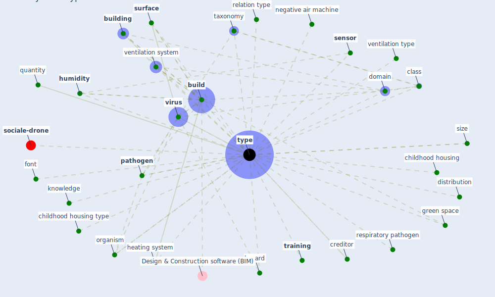

# Keyword: type

* [sociale-drone](cluster_6)

## Keywords

 * Cluster_6, [activity](keyword_activity), [build](keyword_build), [building](keyword_building), childhood housing, childhood housing type, class, creditor, distribution, [domain](keyword_domain), [font](keyword_font), [green space](keyword_green_space), hazard, heating system, [humidity](keyword_humidity), [knowledge](keyword_knowledge), [negative air machine](keyword_negative_air_machine), [office](keyword_office), organism, [pathogen](keyword_pathogen), quantity, relation type, respiratory pathogen, [sensor](keyword_sensor), size, [surface](keyword_surface), taxonomy, [training](keyword_training), [type](keyword_type), types, ventilation system, ventilation type, [virus](keyword_virus)

## Mapping

## Neighbours

### Closest articles

* A review of facilities management interventions to mitigate respiratory infections in existing buildings - [LINK](article_zhang_review_2022)
* An Intelligent IEQ Monitoring and Feedback System: Development and Applications - [LINK](article_geng_intelligent_2021)
* Scalable IoT Architecture for Monitoring IEQ Conditions in Public and Private Buildings - [LINK](article_calvo_scalable_2022)
* Construction of a Linked Data Set of COVID-19 Knowledge Graphs: Development and Applications - [LINK](article_wang_construction_2022)
* A Global Survey of Infection Control and Mitigation Measures for Combating the Transmission of COVID-19 Pandemic in Buildings Under Facilities Management Services - [LINK](article_sarvari_global_2022)
* The role of green roofs in post COVID-19 confinement: An analysis of willingness to pay - [LINK](article_manso_role_2021)
* The removal of airborne SARS-CoV-2 and other microbial bioaerosols by air filtration on COVID-19 surge units - [LINK](article_conway-morris_removal_2021)
* Ventilation use in nonmedical settings during COVID-19: Cleaning protocol, maintenance, and recommendations - [LINK](article_nembhard_ventilation_2020)
* Assessment method for new sustainability indicators providing pandemic resilience for residential buildings - [LINK](article_tokazhanov_assessment_2021)
* World Bank Development Report - [LINK](article_world_bank_world_2022)

### Closest BPs

