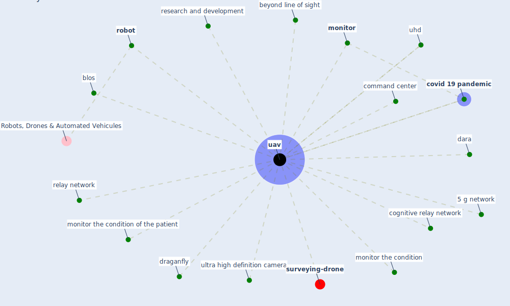

# Keyword: uav

* [surveying-drone](cluster_13)

## Keywords

 * [5 g network](keyword_5_g_network), Cluster_13, beyond line of sight, blos, cognitive relay network, command center, [covid 19 pandemic](keyword_covid_19_pandemic), dara, draganfly, [monitor](keyword_monitor), monitor the condition, monitor the condition of the patient, relay network, research and development, [robot](keyword_robot), [uav](keyword_uav), uhd, ultra high definition camera

## Mapping

## Neighbours

### Closest articles

* Design COVID-19 Ontology: A Healthcare and Safety Perspective - [LINK](article_aloulou_design_2022)
* How the 5G Enabled the COVID-19 Pandemic Prevention and Control: Materiality, Affordance, and (De-)Spatialization - [LINK](article_li_how_2022)
* A Comprehensive Review of the COVID-19 Pandemic and the Role of IoT, Drones, AI, Blockchain, and 5G in Managing its Impact - [LINK](article_chamola_comprehensive_2020)
* Blockchain technology and its applications to combat COVID-19 pandemic - [LINK](article_sharma_blockchain_2022)
* The role of 5G for digital healthcare against COVID-19 pandemic: Opportunities and challenges - [LINK](article_siriwardhana_role_2021)

### Closest BPs

