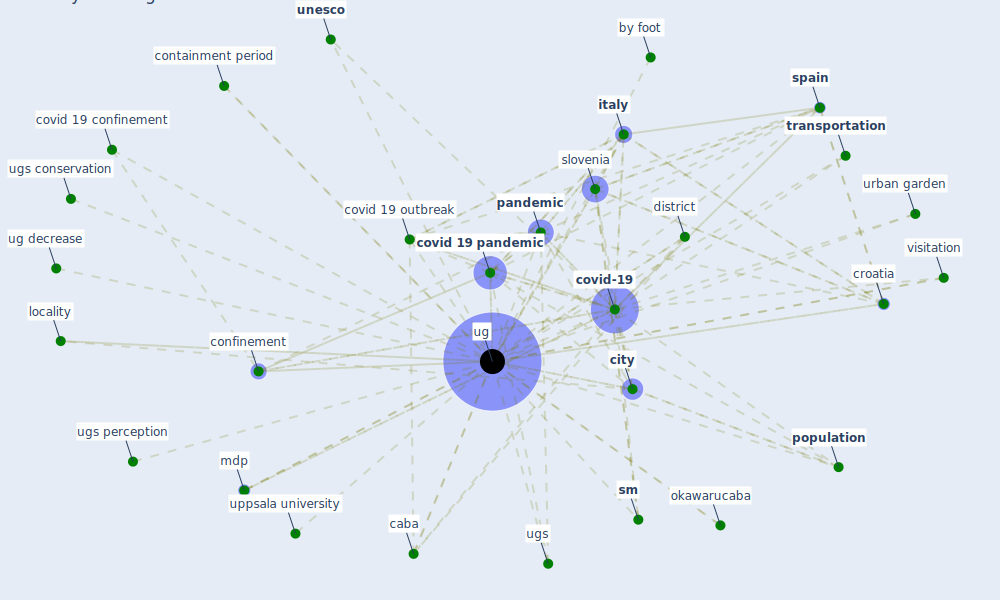

# Keyword: ug

## Keywords

 * accessibility, [bueno air](keyword_bueno_air), bueno air autonomous city, bueno air city, by foot, caba, [city](keyword_city), [confinement](keyword_confinement), containment period, [country](keyword_country), covid 19 confinement, covid 19 outbreak, [covid 19 pandemic](keyword_covid_19_pandemic), covid 19 restriction, covid 19containment, [covid-19](keyword_covid-19), [croatia](keyword_croatia), day, [density](keyword_density), district, [ecosystem](keyword_ecosystem), gather, green infrastructure, influence area, [italy](keyword_italy), lithuania, locality, [management](keyword_management), mdp, okawarucaba, outbreak in italy, [pandemic](keyword_pandemic), park, [population](keyword_population), preparation to ug pre pandemic, public gathering, [slovenia](keyword_slovenia), [sm](keyword_sm), [spain](keyword_spain), [switzerland](keyword_switzerland), [tanzania](keyword_tanzania), [transportation](keyword_transportation), [ug](keyword_ug), ug decrease, ugs, ugs conservation, ugs perception, ugs subj _ caba, [unesco](keyword_unesco), unesco world heritage site, uppsala university, urban garden, urban green space density in city, urban landscape, visitation, vouligny

## Mapping

## Neighbours

### Closest articles

* Effects of the COVID-19 pandemic on the use and perceptions of urban green space: An international exploratory study - [LINK](article_ugolini_effects_2020)
* Green in times of COVID-19: urban green space relevance during the COVID-19 pandemic in Buenos Aires City - [LINK](article_marconi_green_2022)

### Closest BPs

