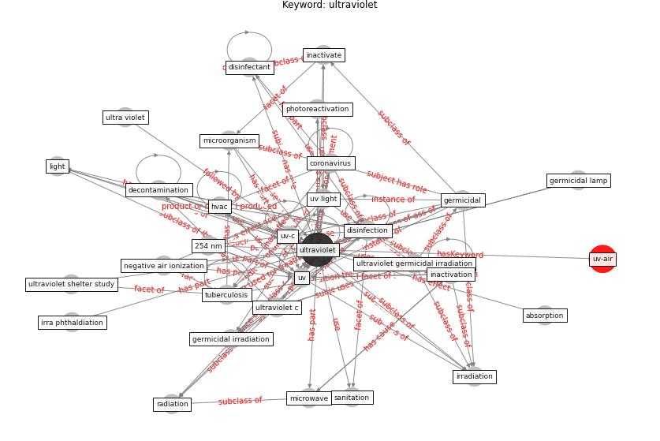

# Keyword: ultraviolet

* [uv-air](cluster_Cluster_4)

## Keywords

 * 254 nm, Cluster_4, absorption, absorption spectrum, [air](keyword_air), alpha hcov 229e, band, cataract, clear the air, [control](keyword_control), [coronavirus](keyword_coronavirus), [decontamination](keyword_decontamination), [disinfectant](keyword_disinfectant), [disinfection](keyword_disinfection), electromagnetic wave, environmental control for tuberculosis, fluence, [germicidal](keyword_germicidal), germicidal irradiation, germicidal lamp, germicidal ultraviolet, guv dose, [hvac](keyword_hvac), [inactivate](keyword_inactivate), [inactivation](keyword_inactivation), incoherent optical radiation, irra phthaldiation, irradiance, [irradiation](keyword_irradiation), iuva, [light](keyword_light), light emit device, [lighting](keyword_lighting), [microorganism](keyword_microorganism), microwave, negative air ionization, non thermal plasma, optical radiation, photoreactivation, [physical](keyword_physical), purify, radiation, sanitation, sanitization, [sar cov 2](keyword_sar_cov_2), solar radiation, spectrum, sterilization, [tuberculosis](keyword_tuberculosis), ultra violet, [ultraviolet](keyword_ultraviolet), ultraviolet c, ultraviolet germicidal irradiation, ultraviolet shelter study, upper room ultraviolet germicidal irradiation, [uv](keyword_uv), [uv light](keyword_uv_light), [uv-c](keyword_uv-c), uvc radiation, uvg, [uvgi](keyword_uvgi), filter

## Concepts

 

## Neighbours

### Closest articles

* Upper-Room Ultraviolet Light and Negative Air Ionization to Prevent Tuberculosis Transmission - [LINK](article_escombe_upper-room_2009)
* Applications of ultraviolet germicidal irradiation disinfection in health care facilities: Effective adjunct, but not stand-alone technology - [LINK](article_memarzadeh_applications_2010)
* Upper-room ultraviolet air disinfection might help to reduce COVID-19 transmission in buildings: a feasibility study - [LINK](article_beggs_upper-room_2020)
* How can airborne transmission of COVID-19 indoors be minimised? - [LINK](article_morawska_how_2020)
* Air Disinfection for Airborne Infection Control with a Focus on COVID‐19: Why Germicidal UV is Essential             † - [LINK](article_nardell_air_2021)
* ASHRAE Position Document on Infectious Aerosols - [LINK](article_ashrae_ashrae_2022)
* A review of facilities management interventions to mitigate respiratory infections in existing buildings - [LINK](article_zhang_review_2022)
* Methods for air cleaning and protection of building occupants from airborne pathogens - [LINK](article_bolashikov_methods_2009)
* Far-UVC light (222 nm) efficiently and safely inactivates airborne human coronaviruses - [LINK](article_buonanno_far-uvc_2020)
* Designing Post COVID-19 Buildings: Approaches for Achieving Healthy Buildings - [LINK](article_navaratnam_designing_2022)

### Closest BPs

