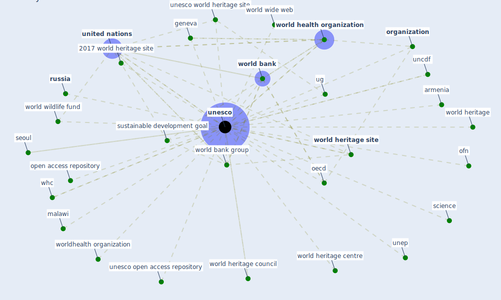

# Keyword: unesco

## Keywords

 * 2017 world heritage site, armenia, coronavirus school closure, coronavirus schoolclosure, covid 19 unesco education sector education, [covid-19](keyword_covid-19), geneva, guideline unwto, iace, isr, lebanon, malawi, [oecd](keyword_oecd), ofn, open access repository, organization, [russia](keyword_russia), science, [seoul](keyword_seoul), [sustainable development goal](keyword_sustainable_development_goal), [ug](keyword_ug), uncdf, unep, [unesco](keyword_unesco), unesco open access repository, unesco world heritage site, [united nations](keyword_united_nations), whc, [world bank](keyword_world_bank), world bank group, [world health organization](keyword_world_health_organization), world heritage, world heritage centre, world heritage council, [world heritage site](keyword_world_heritage_site), world wide web, world wildlife fund, worldhealth organization, yerevan armenia

## Mapping

## Neighbours

### Closest articles

* A critical review of heating, ventilation, and air conditioning (HVAC) systems within the context of a global SARS-CoV-2 epidemic - [LINK](article_elsaid_critical_2021)
* How COVID-19 Could Accelerate the Adoption of New Retail Technologies and Enhance the (E-)Servicescape - [LINK](article_willems_how_2021)
* Biophilic design in architecture and its contributions to health, well-being, and sustainability: A critical review - [LINK](article_zhong_biophilic_2022)
* Green infrastructure through the lens of “One Health”: A systematic review and integrative framework uncovering synergies and trade-offs between mental health and wildlife support in cities - [LINK](article_felappi_green_2020)
* Nurture to nature via COVID-19, a self-regenerating environmental strategy of environment in global context - [LINK](article_paital_nurture_2020)
* Health, Wellbeing \& Productivity in Offices - [LINK](article_world_green_building_council_health_2014)
* World Bank Development Report - [LINK](article_world_bank_world_2022)
* Occupant health in buildings: Impact of the COVID-19 pandemic on the opinions of building professionals and implications on research - [LINK](article_awada_occupant_2022)
* A Platform for Citizen Cooperation during the COVID-19 Pandemic in RN, Brazil - [LINK](article_de_araujo_platform_2020)
* Refleksioner fra en pandemi - [LINK](article_realdania_refleksioner_2022)

### Closest BPs

