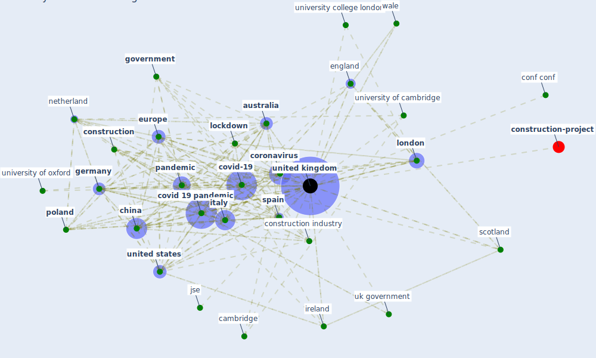

# Keyword: united kingdom

## Keywords

 * abingdon on thame, addenbrooke s hospital, astrazeneca, [australia](keyword_australia), belgium, birmingham, brexit, cambridge, cambridge university press, [canada](keyword_canada), chichester, child tax credit, [china](keyword_china), conf conf, conference conf, [construction](keyword_construction), [construction industry](keyword_construction_industry), construction leadership council, cornwall, [coronavirus](keyword_coronavirus), [country](keyword_country), covid 19 lockdown, covid 19 outbreak, [covid 19 pandemic](keyword_covid_19_pandemic), [covid-19](keyword_covid-19), cyprus, department of health, dpia, dutch, [economy](keyword_economy), edinburgh, effect of pandemic on construction industry in the uk, energy re, england, [europe](keyword_europe), [european union](keyword_european_union), falmer, [france](keyword_france), gdp, [germany](keyword_germany), glasgow, gov, [government](keyword_government), government measure, government measure and human mobility trend, [greece](keyword_greece), [india](keyword_india), ireland, isle of wight, israel, [italy](keyword_italy), [jse](keyword_jse), leicester, liverpool, [lockdown](keyword_lockdown), [london](keyword_london), manchester, [netherland](keyword_netherland), new zealand, nhs, norfolk, northern ireland, oxfordshire, [pandemic](keyword_pandemic), panicbuye, [pcu](keyword_pcu), penguin random house, [poland](keyword_poland), popul popul, prime minister, punist, [sar cov 2](keyword_sar_cov_2), [saudi arabia](keyword_saudi_arabia), scientific advisory group, scotland, secretary of state for transport, sheffield, singapore, southampton, [spain](keyword_spain), [switzerland](keyword_switzerland), the guardian, trade union, transport focus, uae, uk government, [united kingdom](keyword_united_kingdom), [united states](keyword_united_states), university college london, university of cambridge, university of exeter, university of leed, university of oxford, university of southampton, university of strathclyde, [usa](keyword_usa), v2, vat waiver, wale, work programme

## Mapping

## Neighbours

### Closest articles

* Study of COVID-19 pandemic in London (UK) from urban context - [LINK](article_ghosh_study_2020)
* Sustainable work throughout the life course: National policies and strategies, Publications Office of the European Union - [LINK](article_eurofund_sustainable_2016)
* Urban planning after COVID-19 - [LINK](article_rtpi_urban_2021)
* The socio-economic implications of the coronavirus pandemic (COVID-19): A review - [LINK](article_nicola_socio-economic_2020)
* Coronavirus questions that will not go away: interrogating urban and socio-spatial implications of COVID-19 measures - [LINK](article_salama_coronavirus_2020)
* A Platform for Citizen Cooperation during the COVID-19 Pandemic in RN, Brazil - [LINK](article_de_araujo_platform_2020)
* Covid-19 Associated Risks and Mitigation Strategies relevant for the UK Construction Industry - [LINK](article_dan-jumbo_covid-19_2021)
* World Bank Development Report - [LINK](article_world_bank_world_2022)
* Dangerous liaisons? Applying the social harm perspective to the social inequality, housing and health trifecta during the Covid-19 pandemic - [LINK](article_gurney_dangerous_2021)
* The ventilation of buildings and other mitigating measures for COVID-19: a focus on wintertime - [LINK](article_burridge_ventilation_2021)

### Closest BPs

