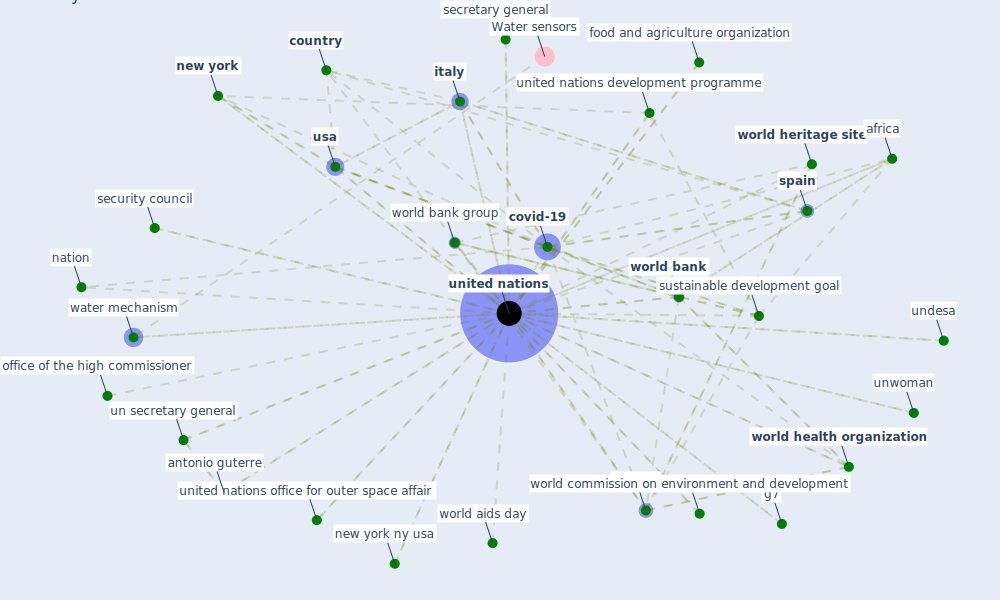

# Keyword: united nations

## Keywords

 * 115 united nations conference on trade and development, [africa](keyword_africa), amnesty international, antonio guterre, asia, [australia](keyword_australia), biodiversity framework, clean water and sanitation, climate change conference, coalition, [community](keyword_community), conference on environment and development, cost of live, cost of live index, [country](keyword_country), [covid 19 pandemic](keyword_covid_19_pandemic), [covid-19](keyword_covid-19), declaration of independence, develop country, development assistance, development programme, economic and labour relation review, [environment](keyword_environment), environment programme, [european union](keyword_european_union), food and agriculture, food and agriculture organization, g20, g7, gender base violence, help hand, human right, imperative for health, imperative for health protection, [italy](keyword_italy), jobseeker aid, knu, kuala lumpur, measure for the economic development of underdeveloped country, [nairobi](keyword_nairobi), nation, [new york](keyword_new_york), [new york city](keyword_new_york_city), new york ny, new york ny usa, office of the high commissioner, oxfam, population division, right to adequate housing, [rome](keyword_rome), [sdgs](keyword_sdgs), secretary general, security council, [spain](keyword_spain), [sustainable development goal](keyword_sustainable_development_goal), sustainable development goal sdgs, sustainable urban, sustainable urban development, the economic and labour relation review, trade and development, un secretary general, undesa, undg, [unesco](keyword_unesco), unesco world heritage site, unfpa, unido, [united nations](keyword_united_nations), united nations development programme, united nations office for outer space affair, united nations security council, unrisd, unsdg, unsecretary general, unwoman, [usa](keyword_usa), water mechanism, who, world aids day, [world bank](keyword_world_bank), world bank group, world commission on environment and development, [world health organization](keyword_world_health_organization), [world heritage site](keyword_world_heritage_site), world tourism organisation, world tourism organization, world wildlife fund

## Mapping

## Neighbours

### Closest articles

* Urban planning after COVID-19 - [LINK](article_rtpi_urban_2021)
* Health, Economic and Social Development Challenges of the COVID-19 Pandemic: Strategies for Multiple and Interconnected Issues - [LINK](article_panneer_health_2022)
* The COVID-19 pandemic: Lessons on building more equal and sustainable societies - [LINK](article_van_barneveld_covid-19_2020)
* Readiness Assessment of Green Building Certification Systems for Residential Buildings during Pandemics - [LINK](article_tleuken_readiness_2021)
* World Bank Development Report - [LINK](article_world_bank_world_2022)
* COVID-19: IMPACT OF THE PANDEMIC ON THE SUSTAINABLE DEVELOPMENT GOALS - [LINK](article_samout_covid-19_2020)
* Building sustainable finance for resilient protected and conserved areas: lessons from COVID-19 - [LINK](article_cumming_building_2021)
* A Comprehensive Review of the COVID-19 Pandemic and the Role of IoT, Drones, AI, Blockchain, and 5G in Managing its Impact - [LINK](article_chamola_comprehensive_2020)
* COVID-19 Could Leverage a Sustainable Built Environment - [LINK](article_pinheiro_covid-19_2020)
* Navigating Climate Change: Rethinking the Role of Buildings - [LINK](article_cole_navigating_2020)

### Closest BPs

