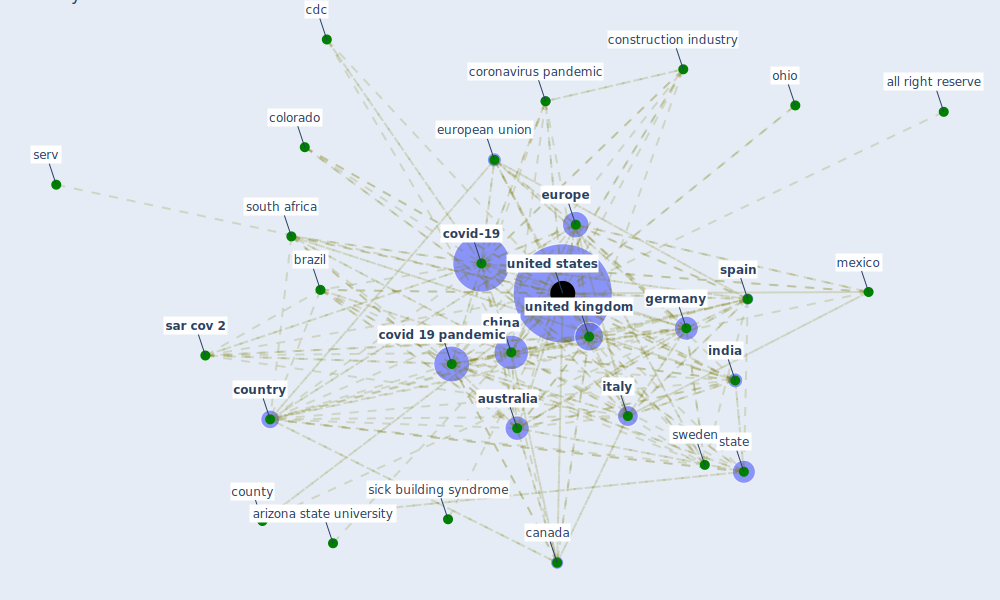

# Keyword: united states

## Keywords

 * [africa](keyword_africa), african american population, all right reserve, america, american economy, american heart association, appalachian region, arizona state university, asia, [australia](keyword_australia), [brazil](keyword_brazil), [canada](keyword_canada), cares act, ccdc, [cdc](keyword_cdc), census, census bureau, [china](keyword_china), colorado, [construction industry](keyword_construction_industry), contiguous, continental, [coronavirus](keyword_coronavirus), coronavirus disease, coronavirus pandemic, [country](keyword_country), country and territory, county, [covid 19 pandemic](keyword_covid_19_pandemic), [covid-19](keyword_covid-19), craigslist, current population survey, declaration of independence, donald trump, epa, [europe](keyword_europe), [european union](keyword_european_union), [germany](keyword_germany), [health care](keyword_health_care), health gov, health symptom, [india](keyword_india), iran, ireland, [italy](keyword_italy), kaufman, [korea](keyword_korea), large economy, latin america, level of urbanicity, [lockdown](keyword_lockdown), lockdown state, med mil, mexico, midwest, nasa, nashville, navajo nation, [new jersey](keyword_new_jersey), [new york](keyword_new_york), [new york city](keyword_new_york_city), noaa, norman, [north america](keyword_north_america), north korea, norway, [obesity](keyword_obesity), ohio, [ok](keyword_ok), other united states, oxford university press, pac pac, [pandemic](keyword_pandemic), pandemic spread of sar cov 2 worldwide, pennsylvania, pennsylvania state university, popul popul, population survey, protect protect, quickfact, republic of korea, sample characteristic, [sar cov 2](keyword_sar_cov_2), seattle, securities and exchange commission, serv, shelter in place order, sick building syndrome, [south africa](keyword_south_africa), southeast asia, southern, [spain](keyword_spain), [state](keyword_state), [sweden](keyword_sweden), [texas](keyword_texas), [united kingdom](keyword_united_kingdom), [united states](keyword_united_states), [usa](keyword_usa), [washington](keyword_washington), zillow

## Mapping

## Neighbours

### Closest articles

* Green spaces, especially forest, linked to lower SARS-CoV-2 infection rates: A one-year nationwide study - [LINK](article_jiang_green_2021)
* What has been the impact of the COVID-19 pandemic on immigrants? An update on recent evidence - [LINK](article_oecd_what_2022)
* World Bank Development Report - [LINK](article_world_bank_world_2022)
* Contextualizing the Covid-19 pandemic for a carbon-constrained world: Insights for sustainability transitions, energy justice, and research methodology - [LINK](article_sovacool_contextualizing_2020)
* Global value chains: Efficiency and risks in the context of COVID-19 - [LINK](article_oecd_global_2021)
* How COVID-19 Could Accelerate the Adoption of New Retail Technologies and Enhance the (E-)Servicescape - [LINK](article_willems_how_2021)
* Mobility Behaviour in View of the Impact of the COVID-19 Pandemic—Public Transport Users in Gdansk Case Study - [LINK](article_przybylowski_mobility_2021)
* Occupant health in buildings: Impact of the COVID-19 pandemic on the opinions of building professionals and implications on research - [LINK](article_awada_occupant_2022)
* Toilets dominate environmental detection of SARS-CoV-2 virus in a hospital - [LINK](article_ding_toilets_2020)
* COVID-19 and a new resilient infrastructure landscape - [LINK](article_oecd_covid-19_2021)

### Closest BPs

