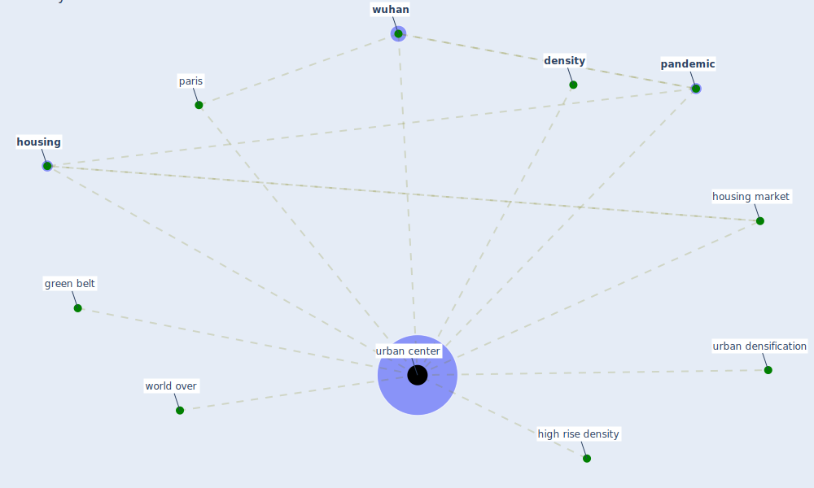

# Keyword: urban center

## Keywords

 * [density](keyword_density), green belt, high rise density, [housing](keyword_housing), housing market, [pandemic](keyword_pandemic), paris, [urban center](keyword_urban_center), urban centers, urban densification, world over, [wuhan](keyword_wuhan)

## Mapping

## Neighbours

### Closest articles

* COVID-19: Lessons for an Urban(izing) World - [LINK](article_acuto_covid-19_2020)
* Prophylactic Architecture: Formulating the Concept of Pandemic-Resilient Homes - [LINK](article_elrayies_prophylactic_2022)
* How our homes impact our health: using a COVID-19 informed approach to examine urban apartment housing - [LINK](article_peters_how_2020)

### Closest BPs

