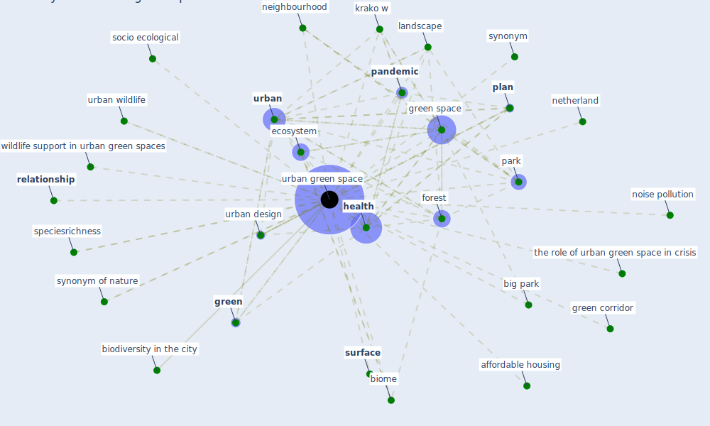

# Keyword: urban green space

## Keywords

 * affordable housing, allergic to pollen, behavior, big park, [biodiversity](keyword_biodiversity), biodiversity in the city, biome, biophilic city, [bueno air](keyword_bueno_air), [community](keyword_community), [crisis](keyword_crisis), [ecosystem](keyword_ecosystem), ecosystem provision service and demand, ecosystem service, [europe](keyword_europe), [forest](keyword_forest), [green](keyword_green), green corridor, [green space](keyword_green_space), [health](keyword_health), impact assessment for health, [krako w](keyword_krako_w), landscape, [nature](keyword_nature), neighbourhood, [netherland](keyword_netherland), noise pollution, [pandemic](keyword_pandemic), pandemic affect how people perceive urban green space, park, park of the city, pave space, per capita, [plan](keyword_plan), public park, public realm, recreation, [relationship](keyword_relationship), restorative environment, restorative environments, socio ecological, speciesrichness, [surface](keyword_surface), synonym, synonym of nature, the role of urban green space in crisis, [urban](keyword_urban), urban design, urban environment, [urban green space](keyword_urban_green_space), urban green spaces, urban nature, urban wildlife, [well be](keyword_well_be), [wildlife](keyword_wildlife), wildlife support, wildlife support in urban green spaces

## Mapping

## Neighbours

### Closest articles

* Green infrastructure through the lens of “One Health”: A systematic review and integrative framework uncovering synergies and trade-offs between mental health and wildlife support in cities - [LINK](article_felappi_green_2020)
* The impact of the COVID-19 pandemic on the importance of urban green spaces to the public - [LINK](article_noszczyk_impact_2022)
* Green in times of COVID-19: urban green space relevance during the COVID-19 pandemic in Buenos Aires City - [LINK](article_marconi_green_2022)
* Effects of the COVID-19 pandemic on the use and perceptions of urban green space: An international exploratory study - [LINK](article_ugolini_effects_2020)
* Urban form: Realising the value of green space: a planners’ perspective on the COVID-19 pandemic - [LINK](article_ahmadpoor_urban_2021)
* COVID-19 and Green Housing: A Review of Relevant Literature - [LINK](article_kaklauskas_covid-19_2021)
* Making green infrastructure healthier infrastructure - [LINK](article_lohmus_making_2015)
* Learning from pandemics: Applying resilience thinking to identify priorities for planning urban settlements - [LINK](article_syal_learning_2021)
* Urban Green Infrastructure and Green Open Spaces: An Issue of Social Fairness in Times of COVID-19 Crisis - [LINK](article_reinwald_urban_2021)
* Association between indoor-outdoor green features and psychological health during the COVID-19 lockdown in Italy: A cross-sectional nationwide study - [LINK](article_spano_association_2021)

### Closest BPs

