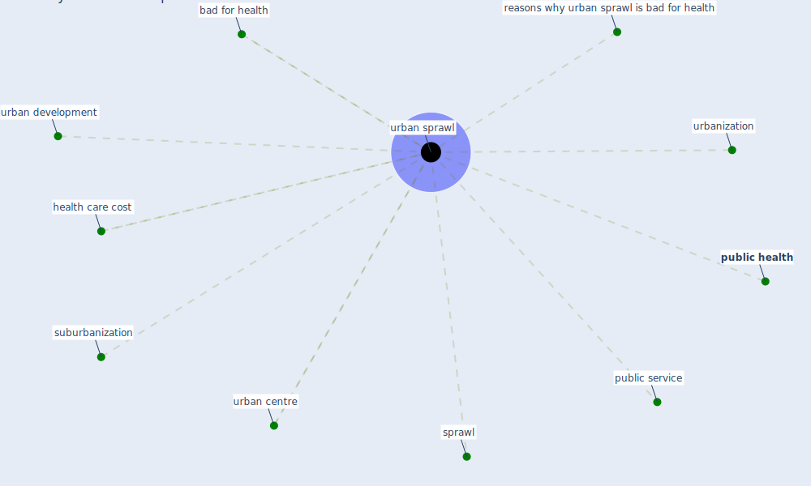

# Keyword: urban sprawl

## Keywords

 * bad for health, health care cost, [public health](keyword_public_health), public service, reasons why urban sprawl is bad for health, sprawl, suburbanization, urban centre, urban development, [urban sprawl](keyword_urban_sprawl), urbanization

## Mapping

## Neighbours

### Closest articles

* Global policy challenges for urban vector-borne disease risks - [LINK](article_alabaster_global_2016)
* Coronavirus questions that will not go away: interrogating urban and socio-spatial implications of COVID-19 measures - [LINK](article_salama_coronavirus_2020)
* The Role of Architecture and Urbanism in Preventing Pandemics - [LINK](article_kumar_role_2021)
* The impact of the COVID-19 pandemic on the importance of urban green spaces to the public - [LINK](article_noszczyk_impact_2022)
* Prototype Early Warning Systems for Vector-Borne Diseases in Europe - [LINK](article_semenza_prototype_2015)
* Contextualizing the Covid-19 pandemic for a carbon-constrained world: Insights for sustainability transitions, energy justice, and research methodology - [LINK](article_sovacool_contextualizing_2020)
* Treating two pandemics for the price of one: Chronic and infectious disease impacts of the built and natural environment - [LINK](article_frank_treating_2021)

### Closest BPs

