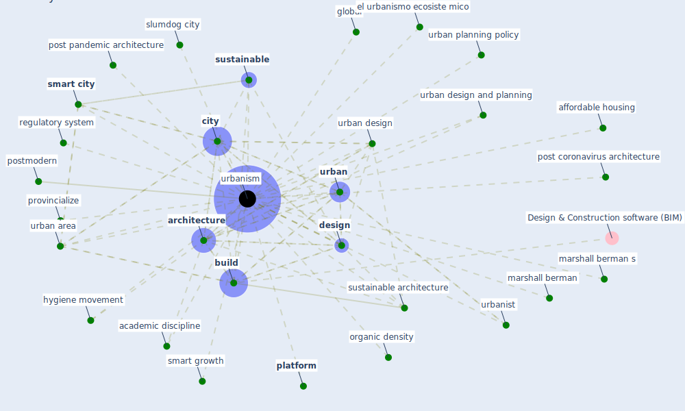

# Keyword: urbanism

## Keywords

 * academic discipline, affordable housing, [architecture](keyword_architecture), [build](keyword_build), [city](keyword_city), contemporary urbanism, [design](keyword_design), discipline, ecological, ecology, ecosystem urbanism, el urbanismo ecosiste mico, global, hygiene movement, marshall berman, marshall berman s, organic density, [platform](keyword_platform), post coronavirus architecture, post pandemic architecture, postmodern, provincialize, regulatory system, slumdog city, [smart city](keyword_smart_city), smart growth, [sustainable](keyword_sustainable), [sustainable architecture](keyword_sustainable_architecture), [urban](keyword_urban), urban area, urban design, urban design and planning, urban planning policy, [urbanism](keyword_urbanism), urbanist, zone

## Mapping

## Neighbours

### Closest articles

* Coronavirus questions that will not go away: interrogating urban and socio-spatial implications of COVID-19 measures - [LINK](article_salama_coronavirus_2020)
* Antivirus-built environment: Lessons learned from Covid-19 pandemic - [LINK](article_megahed_antivirus-built_2020)
* The Role of Architecture and Urbanism in Preventing Pandemics - [LINK](article_kumar_role_2021)
* How the Coronavirus Will Reshape Architecture - [LINK](article_chayka_how_2020)
* COVID-19 and Green Housing: A Review of Relevant Literature - [LINK](article_kaklauskas_covid-19_2021)
* The three modes of existence of the pandemic smart city - [LINK](article_soderstrom_three_2021)
* COVID-19: Lessons for an Urban(izing) World - [LINK](article_acuto_covid-19_2020)
* Effects of the COVID-19 pandemic on the use and perceptions of urban green space: An international exploratory study - [LINK](article_ugolini_effects_2020)
* Learning from the COVID-19 pandemic in governing smart cities - [LINK](article_bolivar_learning_2022)
* Smart cities and the pandemic: digital technologies on the urban management of Brazilian cities - [LINK](article_fariniuk_smart_2020)

### Closest BPs

