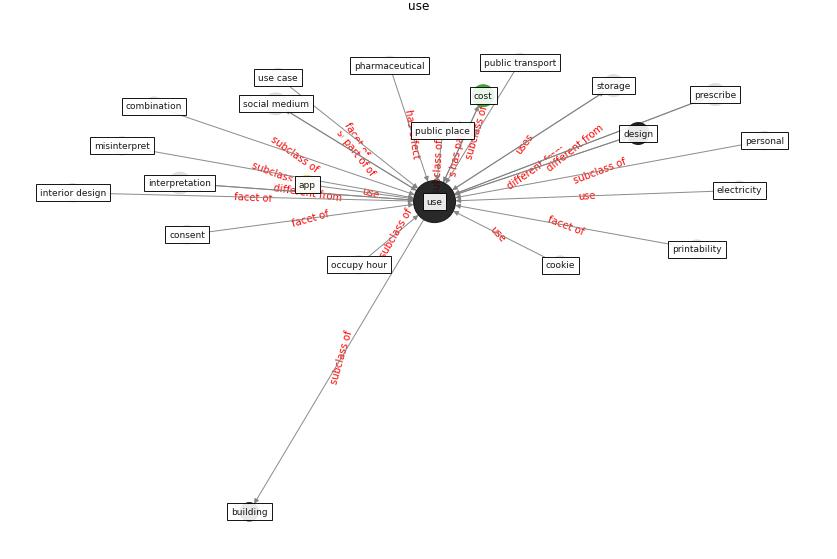

# Keyword: __use__
## Clusters

* Cluster 0: [health-city](cluster_0)
* Cluster 1: [om-ai](cluster_1)
* Cluster 3: [construction-project](cluster_3)
* Cluster 6: [building-guidance](cluster_6)
* Cluster 7: [building-space](cluster_7)
* Cluster 8: [air-ventilation](cluster_8)
* Cluster 10: [fake-medium](cluster_10)
* Cluster 11: [surface-coating](cluster_11)
* Cluster 12: [wastewater-sars](cluster_12)
* Cluster 13: [blockchain-technology](cluster_13)
* Cluster 15: [ontology-datum](cluster_15)

## Concepts

 

## Articles
* The changes in the effects of social media use of
Cypriots due to COVID-19 pandemic ([kaya_changes_2020](article_kaya_changes_2020))
* p15-lee-vor-350 ([p15-lee-vor-350](article_p15-lee-vor-350))
* A Mixed Approach on Resilience of Spanish
Dwellings and Households during COVID-19 Lockdown ([cuerdo-vilches_mixed_2020](article_cuerdo-vilches_mixed_2020))
* The changes in the effects of social media use of
Cypriots due to COVID-19 pandemic ([kaya_changes_2020](article_kaya_changes_2020))
* WHO-2019-nCoV-Urban_preparedness-2020 ([WHO-2019-nCoV-Urban_preparedness-2020](article_WHO-2019-nCoV-Urban_preparedness-2020))
* who_strengthening_2017-0 ([who_strengthening_2017-0](article_who_strengthening_2017-0))
* The changes in the effects of social media use of
Cypriots due to COVID-19 pandemic ([kaya_changes_2020](article_kaya_changes_2020))
* ashrae_ashrae_2022-0 ([ashrae_ashrae_2022-0](article_ashrae_ashrae_2022-0))
* ashrae_ashrae_2022-100 ([ashrae_ashrae_2022-100](article_ashrae_ashrae_2022-100))
* council_of_europe_2020_2020-400 ([council_of_europe_2020_2020-400](article_council_of_europe_2020_2020-400))
