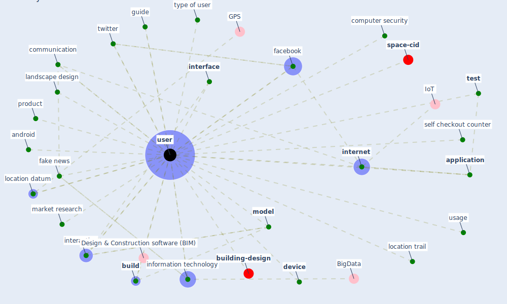

# Keyword: user

* [building-design](cluster_2)

* [space-cid](cluster_5)

## Keywords

 * Cluster_2, Cluster_5, android, [application](keyword_application), [build](keyword_build), communication, computer security, [device](keyword_device), [facebook](keyword_facebook), [fake news](keyword_fake_news), guide, information technology, [interaction](keyword_interaction), [interface](keyword_interface), [internet](keyword_internet), landscape design, location datum, location trail, market research, [model](keyword_model), product, self checkout counter, [test](keyword_test), [twitter](keyword_twitter), type of user, usage, [user](keyword_user), users

## Mapping

## Neighbours

### Closest articles

* The changes in the effects of social media use of Cypriots due to COVID-19 pandemic - [LINK](article_kaya_changes_2020)
* Questioning the use of the balcony in apartments during the COVID-19 pandemic process - [LINK](article_aydin_questioning_2020)
* How loneliness is talked about in social media during COVID-19 pandemic: Text mining of 4,492 Twitter feeds - [LINK](article_koh_how_2022)
* How COVID-19 Could Accelerate the Adoption of New Retail Technologies and Enhance the (E-)Servicescape - [LINK](article_willems_how_2021)
* Mobile Technology Solution for COVID-19: Surveillance and Prevention - [LINK](article_raza_mobile_2021)
* Ten questions concerning occupant health in buildings during normal operations and extreme events including the COVID-19 pandemic - [LINK](article_awada_ten_2021)
* COVID-19 Could Leverage a Sustainable Built Environment - [LINK](article_pinheiro_covid-19_2020)
* A Mixed Approach on Resilience of Spanish Dwellings and Households during COVID-19 Lockdown - [LINK](article_cuerdo-vilches_mixed_2020)
* Infodemic and the spread of fake news in the COVID-19-era - [LINK](article_orso_infodemic_2020)
* What drives unverified information sharing and cyberchondria during the COVID-19 pandemic? - [LINK](article_laato_what_2020)

### Closest BPs

