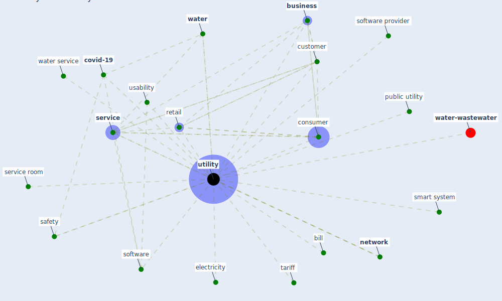

# Keyword: utility

* [water-wastewater](cluster_7)

## Keywords

 * Cluster_7, bill, [business](keyword_business), [consumer](keyword_consumer), [covid-19](keyword_covid-19), [customer](keyword_customer), electricity, [network](keyword_network), public utility, retail, [safety](keyword_safety), [service](keyword_service), service room, smart system, software, software provider, tariff, usability, utilities, [utility](keyword_utility), [water](keyword_water), water service

## Mapping

## Neighbours

### Closest articles

* Designing a Multi-Agent Occupant Simulation System to Support Facility Planning and Analysis for COVID-19 - [LINK](article_lee_designing_2021)
* When the fourth water and digital revolution encountered COVID-19 - [LINK](article_poch_when_2020)
* World Bank Development Report - [LINK](article_world_bank_world_2022)
* Applications of ultraviolet germicidal irradiation disinfection in health care facilities: Effective adjunct, but not stand-alone technology - [LINK](article_memarzadeh_applications_2010)
* An Automated System to Limit COVID-19 Using Facial Mask Detection in Smart City Network - [LINK](article_rahman_automated_2020)
* How is COVID-19 Experience Transforming Sustainability Requirements of Residential Buildings? A Review - [LINK](article_tokazhanov_how_2020)
* Covid-19 and asset management in EU: a preliminary assessment of performance and investment styles - [LINK](article_rizvi_covid-19_2020)
* The effect of a redesigned floor plan, occupant density and the quality of indoor climate on the cost of space, productivity and sick leave in an office building–A case study - [LINK](article_saari_effect_2006)

### Closest BPs

