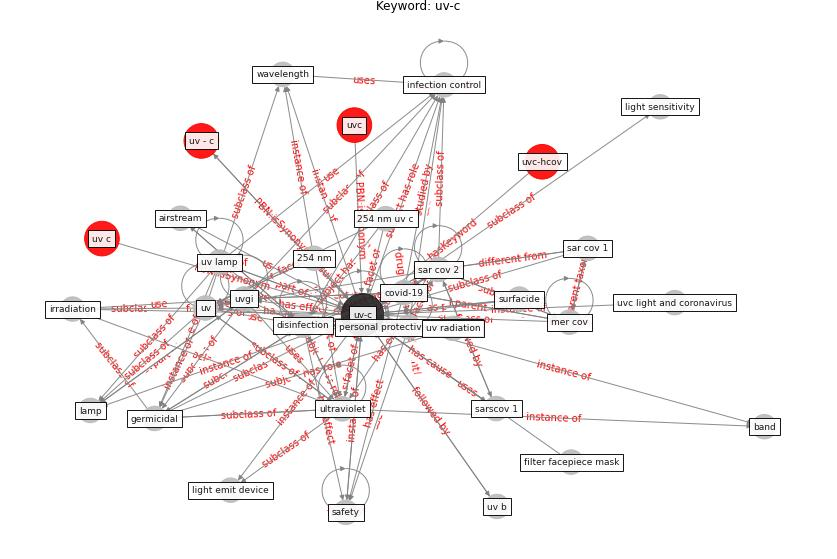

# Keyword: uv-c

* [uvc-hcov](cluster_Cluster_7)

## Keywords

 * 254 nm, 254 nm uv c, 254 psynetnm, Cluster_7, aerosolise, airstream, band, carcinogen, [covid-19](keyword_covid-19), deactivate, [decontamination](keyword_decontamination), decontamination device, di rect, disinfect, [disinfection](keyword_disinfection), disinfection robot, filter facepiece mask, [germicidal](keyword_germicidal), health effect, hepa, [infection control](keyword_infection_control), [irradiation](keyword_irradiation), [lamp](keyword_lamp), [light](keyword_light), light emit device, light sensitivity, light source, [lighting](keyword_lighting), [mer cov](keyword_mer_cov), microbe, [microorganism](keyword_microorganism), mitigation step, [personal protective equipment](keyword_personal_protective_equipment), probable human carcinogen, [robot](keyword_robot), [safety](keyword_safety), safety of uv c, [sar cov 1](keyword_sar_cov_1), [sar cov 2](keyword_sar_cov_2), sar cov 2 virus, sarscov 1, [surfacide](keyword_surfacide), surfacide disinfection system, [ultraviolet](keyword_ultraviolet), [uv](keyword_uv), uv - c, uv b, uv c, uv lamp, uv radiation, [uv-c](keyword_uv-c), uvc, uvc light, uvc light and coronavirus, [uvgi](keyword_uvgi), [virus](keyword_virus), wavelength, µm

## Concepts

 

## Neighbours

### Closest articles

* Upper-room ultraviolet air disinfection might help to reduce COVID-19 transmission in buildings: a feasibility study - [LINK](article_beggs_upper-room_2020)
* Applications of ultraviolet germicidal irradiation disinfection in health care facilities: Effective adjunct, but not stand-alone technology - [LINK](article_memarzadeh_applications_2010)
* Efficacy of an Automated Multiple Emitter Whole-Room Ultraviolet-C Disinfection System Against Coronaviruses MHV and MERS-CoV - [LINK](article_bedell_efficacy_2016)
* Effect of Ultraviolet Germicidal Irradiation on Viral Aerosols - [LINK](article_walker_effect_2007)
* Case Study: Using Germicidal UV-C to Mitigate COVID-19 - HVAC - [LINK](article_healthcare_facilities_today_case_2021)
* ASHRAE Position Document on Infectious Aerosols - [LINK](article_ashrae_ashrae_2022)
* Recently employed engineering techniques to reduce the spread of COVID-19 (corona virus disease 2019): a review study - [LINK](article_saman_recently_2021)
* Behind the Update: ASHRAE Handbook Chapters on UV-C to Include Updated Best Practices, Guidance - [LINK](article_ashrae_behind_2020)
* How can airborne transmission of COVID-19 indoors be minimised? - [LINK](article_morawska_how_2020)
* A review of facilities management interventions to mitigate respiratory infections in existing buildings - [LINK](article_zhang_review_2022)

### Closest BPs

