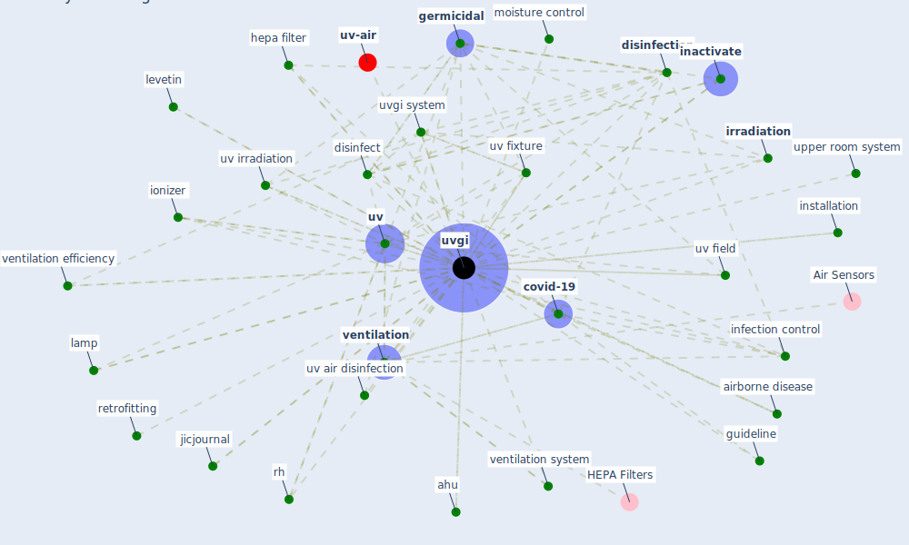

# Keyword: uvgi

* [air-uv](cluster_10)

## Keywords

 * Cluster_10, ac h, [aerosol](keyword_aerosol), ahu, air irradiation, airborne disease, airborne transmission, avital, bipolar ionization system, ceil ing, ceiling mount fan, center for diseasecontrol and prevention, cfd, cfd simulation, [covid-19](keyword_covid-19), dilution, [disinfect](keyword_disinfect), [disinfectant](keyword_disinfectant), [disinfection](keyword_disinfection), disinfection of air, disinfection system, displacement ventilation system, distribution, droplet nuclei, duct uvgi, effective measure, effective measure against microbe, engineering control, fan, [filter](keyword_filter), [filtration](keyword_filtration), [germicidal](keyword_germicidal), germicidalirradiation, gingemicidal, guideline, health care facility, [hepa](keyword_hepa), hepa filter, hepa filter, humidity control, [hvac](keyword_hvac), iaq control, in duct, in duct installation, in duct irradiation, inactivate, inactivate microbe, [infection control](keyword_infection_control), infection prevention, installation, [ionizer](keyword_ionizer), [irradiation](keyword_irradiation), jicjournal, lamp, levetin, louver, manufacturer, [microorganism](keyword_microorganism), moisture control, nuclei, retrofitting, [rh](keyword_rh), room air, safe uvgi, safety issue, sensitivity, sing, [surface](keyword_surface), [tuberculosis](keyword_tuberculosis), [ultraviolet](keyword_ultraviolet), ultraviolet germicidal, upper room, upper room system, upper room uvgi, upperroom uvgi, [uv](keyword_uv), uv air disinfection, uv effluence, uv field, uv fixture, uv irradiation, uv ray, uv field, uv flux, [uv-c](keyword_uv-c), [uvgi](keyword_uvgi), uvgi air disinfection, uvgi distribution, uvgi drug, uvgi fixture, uvgi system, uvgi technology, uvgi uvgi, [ventilation](keyword_ventilation), ventilation efficiency, ventilation system, walker, walker ko, [well](keyword_well), fluid dynamic

## Mapping

## Neighbours

### Closest articles

* Applications of ultraviolet germicidal irradiation disinfection in health care facilities: Effective adjunct, but not stand-alone technology - [LINK](article_memarzadeh_applications_2010)
* A review of facilities management interventions to mitigate respiratory infections in existing buildings - [LINK](article_zhang_review_2022)
* Upper-room ultraviolet air disinfection might help to reduce COVID-19 transmission in buildings: a feasibility study - [LINK](article_beggs_upper-room_2020)
* Methods for air cleaning and protection of building occupants from airborne pathogens - [LINK](article_bolashikov_methods_2009)
* Designing Post COVID-19 Buildings: Approaches for Achieving Healthy Buildings - [LINK](article_navaratnam_designing_2022)
* Indoor Air Quality: Rethinking rules of building design strategies in post-pandemic architecture - [LINK](article_megahed_indoor_2021)
* Environmental factors involved in SARS-CoV-2 transmission: effect and role of indoor environmental quality in the strategy for COVID-19 infection control - [LINK](article_azuma_environmental_2020)
* A critical review of heating, ventilation, and air conditioning (HVAC) systems within the context of a global SARS-CoV-2 epidemic - [LINK](article_elsaid_critical_2021)
* Review and comparison of HVAC operation guidelines in different countries during the COVID-19 pandemic - [LINK](article_guo_review_2021)
* Effect of Ultraviolet Germicidal Irradiation on Viral Aerosols - [LINK](article_walker_effect_2007)

### Closest BPs

