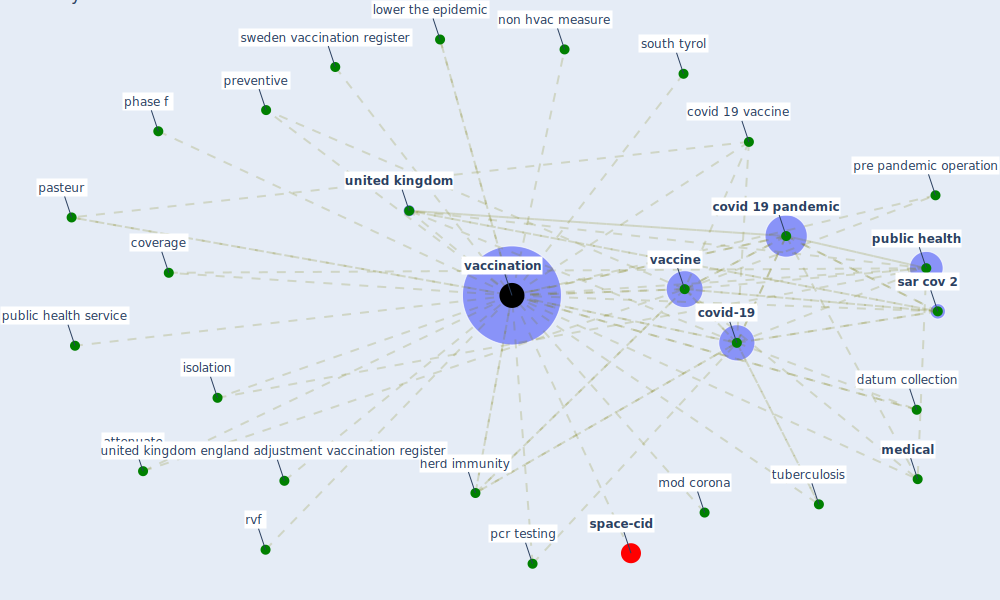

# Keyword: vaccination

* [space-cid](cluster_2)

## Keywords

 * Cluster_2, a study from norway, antivaxxer movement, attenuate, [clinic](keyword_clinic), coverage, [covid 19 pandemic](keyword_covid_19_pandemic), covid 19 vaccine, [covid-19](keyword_covid-19), datum collection, [efficacy](keyword_efficacy), efficacy against newly emerge strain, [health system](keyword_health_system), herd immunity, håndspritten, [infection](keyword_infection), influenza, isolation, lower the epidemic, [medical](keyword_medical), mod corona, non hvac, non hvac measure, non hvac measure for break the chain of infection, norway vaccination register, pasteur, pcr testing, pharmaceutical, pharmacy, phase f, pre pandemic operation, preventive, [public health](keyword_public_health), public health service, rvf, [sar cov 2](keyword_sar_cov_2), south tyrol, sweden vaccination register, [tuberculosis](keyword_tuberculosis), [united kingdom](keyword_united_kingdom), united kingdom england adjustment vaccination register, [vaccination](keyword_vaccination), vaccinations, [vaccine](keyword_vaccine), vaccine be not yet widely available

## Mapping

## Neighbours

### Closest articles

* Digital Twin of COVID-19 Mass Vaccination Centers - [LINK](article_pilati_digital_2021)
* What has been the impact of the COVID-19 pandemic on immigrants? An update on recent evidence - [LINK](article_oecd_what_2022)
* Refleksioner fra en pandemi - [LINK](article_realdania_refleksioner_2022)
* Making green infrastructure healthier infrastructure - [LINK](article_lohmus_making_2015)
* Impact of COVID-19 on IoT Adoption in Healthcare, Smart Homes, Smart Buildings, Smart Cities, Transportation and Industrial IoT - [LINK](article_umair_impact_2021)
* Architectural design strategies for infection prevention and control (IPC) in health-care facilities: towards curbing the spread of Covid-19 \textbar SpringerLink - [LINK](article_udomiaye_architectural_2020)
* Assessment method for new sustainability indicators providing pandemic resilience for residential buildings - [LINK](article_tokazhanov_assessment_2021)
* Contributions of Smart City Solutions and Technologies to Resilience against the COVID-19 Pandemic: A Literature Review - [LINK](article_sharifi_contributions_2021)
* Will a pandemic change building codes? - [LINK](article_rozgus_will_2020)
* It’s time to reimagine where and how work will get done (PwC’s US Remote Work Survey) - [LINK](article_pricewaterhousecoopers_its_2021)

### Closest BPs

