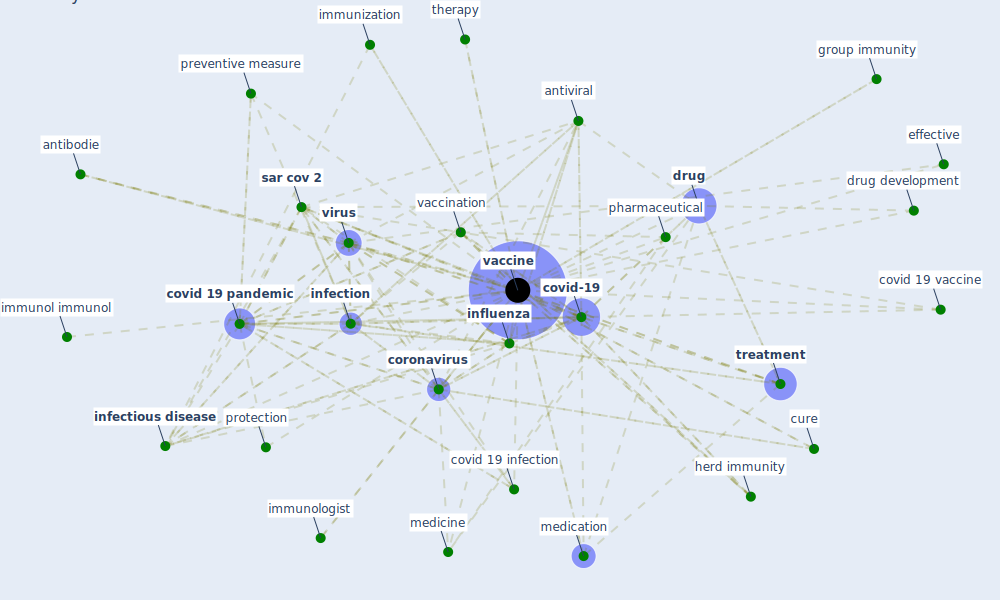

# Keyword: vaccine

## Keywords

 * adenovirus type 5 vector, antibodie, [antiviral](keyword_antiviral), attenuate, b21, b26, biotech, [blockchain](keyword_blockchain), [climate change](keyword_climate_change), [coronavirus](keyword_coronavirus), coronavirus vaccine, covax, covid 19 infection, [covid 19 pandemic](keyword_covid_19_pandemic), covid 19 vaccine, covid 19 vaccine effectiveness in new york state, [covid-19](keyword_covid-19), covid19 pandemic, curative, cure, develop, develop and test properly, development, [drug](keyword_drug), drug development, drug therapy, effective, effective treatment, effective vaccine, [epidemiology](keyword_epidemiology), etzioni, evolve virus variant, group immunity, [health](keyword_health), health agent, herd immunity, immune, immune to the virus, immunisation, immunization, immunol immunol, immunologist, immunotherapeutic, infectability, [infection](keyword_infection), [infectious disease](keyword_infectious_disease), [influenza](keyword_influenza), [information](keyword_information), inoculation, inoculation phase, intervention, ivi, lag development of vaccine, mass vaccination, medication, medicine, multidose, multiple dose, no cure, ongoing research, ospa, [pandemic](keyword_pandemic), pasteur institute, pharmaceutical, preventive measure, [process](keyword_process), protection, protection against re infection, [public health](keyword_public_health), reduce or even eradicate, reduce or even eradicate the disease, registration, [researcher](keyword_researcher), risk of exposure and spread, risk of exposure and spread the virus, rollout, safety measure, [sar cov 2](keyword_sar_cov_2), side effect, specific medicine, therapeutic, therapeutic drug, therapy, tickinfection, [treatment](keyword_treatment), unvaccinate, vaccination, vaccinationsprocenten I alle lande, [vaccine](keyword_vaccine), vaccine be limit, vaccine candidate, vaccine develop vaccine, vaccine development, vaccine ontology, vaccinecenter, virkeligheden, [virus](keyword_virus), vodafone, vulnerable, våben

## Mapping

## Neighbours

### Closest articles

* A Comprehensive Review of the COVID-19 Pandemic and the Role of IoT, Drones, AI, Blockchain, and 5G in Managing its Impact - [LINK](article_chamola_comprehensive_2020)
* Digital Twin of COVID-19 Mass Vaccination Centers - [LINK](article_pilati_digital_2021)
* Graphene-based nanomaterials as antimicrobial surface coatings: A parallel approach to restrain the expansion of COVID-19 - [LINK](article_ayub_graphene-based_2021)
* Current knowledge of COVID-19: Advances, challenges and future perspectives - [LINK](article_wu_current_2021)
* CIDO, a community-based ontology for coronavirus disease knowledge and data integration, sharing, and analysis - [LINK](article_he_cido_2020)
* How COVID-19 Could Accelerate the Adoption of New Retail Technologies and Enhance the (E-)Servicescape - [LINK](article_willems_how_2021)
* Physical interventions to interrupt or reduce the spread of respiratory viruses: systematic review - [LINK](article_jefferson_physical_2008)
* What has been the impact of the COVID-19 pandemic on immigrants? An update on recent evidence - [LINK](article_oecd_what_2022)
* Nurture to nature via COVID-19, a self-regenerating environmental strategy of environment in global context - [LINK](article_paital_nurture_2020)
* Coronavirus disease 2019: The harms of exaggerated information and non‐evidence‐based measures - [LINK](article_ioannidis_coronavirus_2020)

### Closest BPs

