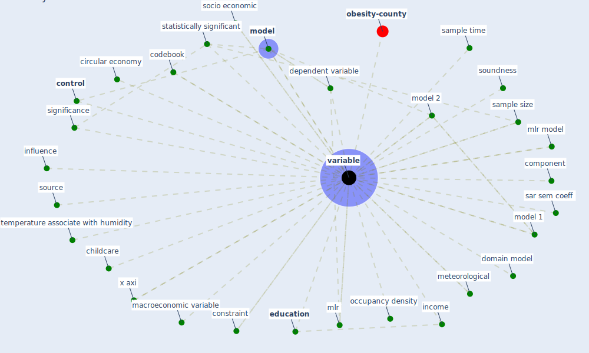

# Keyword: variable

* [obesity-county](cluster_9)

## Keywords

 * Cluster_9, bank level variable, [build environment](keyword_build_environment), callsimt, childcare, [circular economy](keyword_circular_economy), codebook, component, [constraint](keyword_constraint), [control](keyword_control), daily confirm infection, daily death, daily recovery, database, [datum](keyword_datum), datum bias, [demographic](keyword_demographic), dependent variable, descriptive statistic, [domain](keyword_domain), domain model, econometric estimation, [education](keyword_education), explanatory variable, [factor](keyword_factor), feature, [fix](keyword_fix), [health](keyword_health), household income, importance, income, influence, key control, macroeconomic variable, main variable, [material](keyword_material), meteorological, mlr, mlr model, [model](keyword_model), model 1, model 2, motivate, npl l, occupancy density, p value, parametric, pca, population size, sample size, sample time, sar sem coeff, significance, socio economic, soundness, source, statistically significant, temperature associate with humidity, [variable](keyword_variable), variables, vbd control, vbd control decisions, woman, woman specific, x axi

## Mapping

## Neighbours

### Closest articles

* COVID-19 and regional solutions for mitigating the risk of SME finance in selected ASEAN member states - [LINK](article_taghizadeh-hesary_covid-19_2022)
* Urban design attributes and resilience: COVID-19 evidence from New York City - [LINK](article_yang_urban_2021)
* The role of green roofs in post COVID-19 confinement: An analysis of willingness to pay - [LINK](article_manso_role_2021)
* Validity of energy social research during and after COVID-19: challenges, considerations, and responses - [LINK](article_fell_validity_2020)
* The socio-economic determinants of COVID-19: A spatial analysis of German county level data - [LINK](article_ehlert_socio-economic_2021)
* Treating two pandemics for the price of one: Chronic and infectious disease impacts of the built and natural environment - [LINK](article_frank_treating_2021)
* Social distancing enhanced automated optimal design of physical spaces in the wake of the COVID-19 pandemic - [LINK](article_ugail_social_2021)
* Mitigation strategies and compliance in the COVID-19 fight; how much compliance is enough? - [LINK](article_mukerjee_mitigation_2021)
* COVID-19 and the rise of intimate partner violence - [LINK](article_aguero_covid-19_2021)
* The Socio-Spatial Determinants of COVID-19 Diffusion: The Impact of Globalisation, Settlement Characteristics and Population - [LINK](article_sigler_socio-spatial_2020)

### Closest BPs

