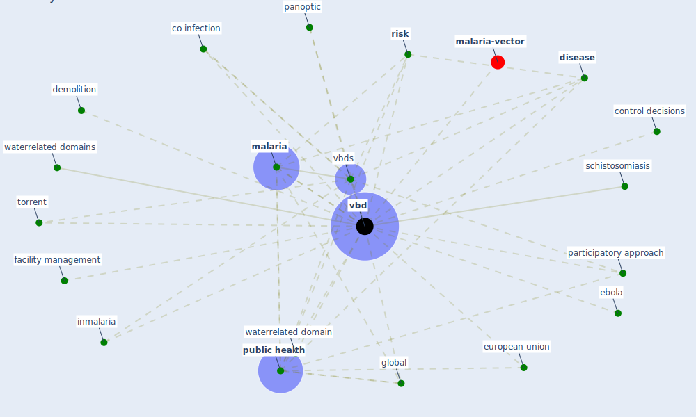

# Keyword: vbd

* [malaria-vector](cluster_13)

## Keywords

 * Cluster_13, co infection, control decisions, demolition, [disease](keyword_disease), ebola, [european union](keyword_european_union), [facility management](keyword_facility_management), global, inmalaria, [malaria](keyword_malaria), panoptic, participatory approach, [public health](keyword_public_health), [risk](keyword_risk), schistosomiasis, torrent, [vbd](keyword_vbd), vbds, waterrelated domain, waterrelated domains

## Mapping

## Neighbours

### Closest articles

* Addressing vulnerability, building resilience: community-based adaptation to vector-borne diseases in the context of global change - [LINK](article_bardosh_addressing_2017)
* Decision Making within the Built Environment as a Strategy for Mitigating the Risk of Malaria and Other Vector-Borne Diseases - [LINK](article_obonyo_decision_2018)
* Prototype Early Warning Systems for Vector-Borne Diseases in Europe - [LINK](article_semenza_prototype_2015)

### Closest BPs

