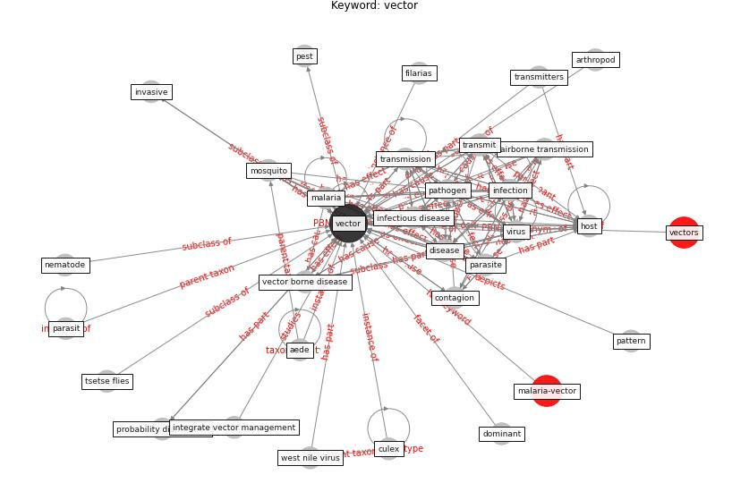

# Keyword: vector

* [malaria-vector](cluster_Cluster_12)

## Keywords

 * Cluster_12, adenovirus type 5, aede, aegypti, [air](keyword_air), airborne transmission, anophele, arthropod, consequence of global warming, contagion, container bred, culex, [disease](keyword_disease), disease agent, disease agents, dominant, dynamic, ectoparasitic, [epidemic](keyword_epidemic), epidemiological cycle, filarias, flea, free, host, human host, [infection](keyword_infection), [infectious disease](keyword_infectious_disease), insect, integrate vector management, invasive, lagrange multipli vector, legionnaire disease, [malaria](keyword_malaria), [mosquito](keyword_mosquito), nematode, nematodes, noncompetent vector, organism, parasit, parasite, particulate matter, [pathogen](keyword_pathogen), pattern, pest, [population](keyword_population), probability distribution, rift valley fever virus, [sar cov 2](keyword_sar_cov_2), specie, [surveillance](keyword_surveillance), tick, [transmission](keyword_transmission), transmit, transmitters, tsetse flies, [vector](keyword_vector), [vector borne disease](keyword_vector_borne_disease), vectors, [virus](keyword_virus), waste, west nile virus

## Concepts

 

## Neighbours

### Closest articles

* Addressing vulnerability, building resilience: community-based adaptation to vector-borne diseases in the context of global change - [LINK](article_bardosh_addressing_2017)
* The impact of climate change on the epidemiology and control of Rift Valley fever - PubMed - [LINK](article_martin_impact_2008)
* Learning from pandemics: Applying resilience thinking to identify priorities for planning urban settlements - [LINK](article_syal_learning_2021)
* Prototype Early Warning Systems for Vector-Borne Diseases in Europe - [LINK](article_semenza_prototype_2015)
* Vector-borne disease, climate change and urban design - [LINK](article_ogden_vector-borne_2016)
* Making green infrastructure healthier infrastructure - [LINK](article_lohmus_making_2015)
* Challenges to Mitigating the Urban Health Burden of Mosquito-Borne Diseases in the Face of Climate Change - [LINK](article_ligsay_challenges_2021)
* Decision Making within the Built Environment as a Strategy for Mitigating the Risk of Malaria and Other Vector-Borne Diseases - [LINK](article_obonyo_decision_2018)
* COVID-19 Could Leverage a Sustainable Built Environment - [LINK](article_pinheiro_covid-19_2020)
* COVID-19 risks and systemic gaps in Nigeria: resilience building lessons for pandemic and climate change management - [LINK](article_lawal_covid-19_2022)

### Closest BPs

