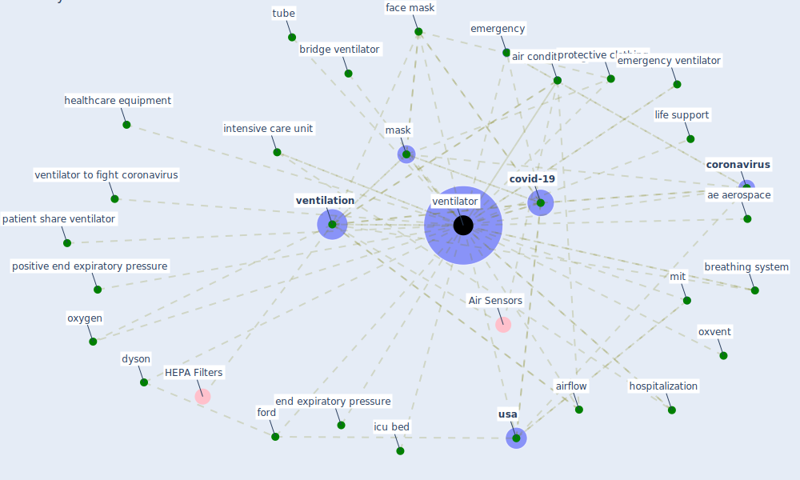

# Keyword: ventilator

## Keywords

 * ae aerospace, [air conditioning](keyword_air_conditioning), airflow, breathing system, bridge ventilator, [coronavirus](keyword_coronavirus), [covid-19](keyword_covid-19), dyson, emergency, emergency ventilator, end expiratory pressure, face mask, ford, [healthcare](keyword_healthcare), healthcare equipment, hospitalization, icu bed, intensive care unit, kitchen exhaust fume fan, life support, lifesave machine, [mask](keyword_mask), mit, oxvent, oxygen, patient share ventilator, positive end expiratory pressure, protective clothing, tube, [usa](keyword_usa), [ventilation](keyword_ventilation), [ventilator](keyword_ventilator), ventilator to fight coronavirus, ventilators

## Mapping

## Neighbours

### Closest articles

* Supporting Technologies for COVID-19 Prevention: Systemized Review - [LINK](article_zhao_supporting_2022)
* A critical analysis of the impacts of COVID-19 on the global economy and ecosystems and opportunities for circular economy strategies - [LINK](article_ibn-mohammed_critical_2021)
* A Comprehensive Review of the COVID-19 Pandemic and the Role of IoT, Drones, AI, Blockchain, and 5G in Managing its Impact - [LINK](article_chamola_comprehensive_2020)
* The COVID-19 pandemic: Lessons on building more equal and sustainable societies - [LINK](article_van_barneveld_covid-19_2020)
* Borders and Catastrophe: lessons from COVID-19 for the European Green Deal - [LINK](article_klein_borders_2021)
* Contributions of Smart City Solutions and Technologies to Resilience against the COVID-19 Pandemic: A Literature Review - [LINK](article_sharifi_contributions_2021)
* Designing for COVID-2x: Reflecting on Future-Proofing Human Habitation for the Inevitable Next Pandemic - [LINK](article_spennemann_designing_2022)
* The socio-economic implications of the coronavirus pandemic (COVID-19): A review - [LINK](article_nicola_socio-economic_2020)
* COVID-19 and a new resilient infrastructure landscape - [LINK](article_oecd_covid-19_2021)
* Blockchain technology and its applications to combat COVID-19 pandemic - [LINK](article_sharma_blockchain_2022)

### Closest BPs

