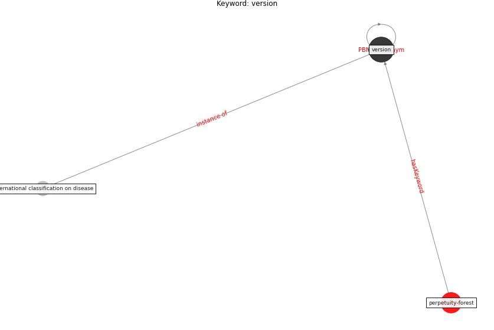

# Keyword: version

* [perpetuity-forest](cluster_Cluster_6)

## Keywords

 * Cluster_6, international classification on disease, [version](keyword_version)

## Concepts

 

## Neighbours

### Closest articles

* Mental health economics: A prospective study on psychological flourishing and associations with healthcare costs and sickness benefit transfers in Denmark - [LINK](article_santini_mental_2021)

### Closest BPs

