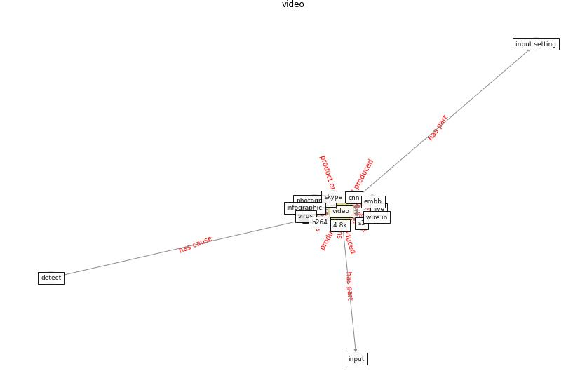

# Keyword: __video__
## Clusters

* Cluster 13: [blockchain-technology](cluster_13.md)

## Concepts

 

## Articles
* tong_coronavirus_2020-0 ([tong_coronavirus_2020-0](article_tong_coronavirus_2020-0.md))
* p15-lee-vor-200 ([p15-lee-vor-200](article_p15-lee-vor-200.md))
* realdania_refleksioner_2022_EN-3450 ([realdania_refleksioner_2022_EN-3450](article_realdania_refleksioner_2022_EN-3450.md))
* RUDDS_bioRxiv_update-250 ([RUDDS_bioRxiv_update-250](article_RUDDS_bioRxiv_update-250.md))
* Understanding the role of urban design in disease
spreading ([brizuela_understanding_2019](article_brizuela_understanding_2019.md))
* The changes in the effects of social media use of
Cypriots due to COVID-19 pandemic ([kaya_changes_2020](article_kaya_changes_2020.md))
* Combating COVID-19—The role of robotics in managing
public health and infectious diseases ([yang_combating_2020](article_yang_combating_2020.md))
* The role of 5G for digital healthcare against COVID-19
pandemic: Opportunities and challenges ([siriwardhana_role_2021](article_siriwardhana_role_2021.md))
* Understanding the role of urban design in disease
spreading ([brizuela_understanding_2019](article_brizuela_understanding_2019.md))
* Treating two pandemics for the price of one: Chronic and
infectious disease impacts of the built and natural
environment ([frank_treating_2021](article_frank_treating_2021.md))
